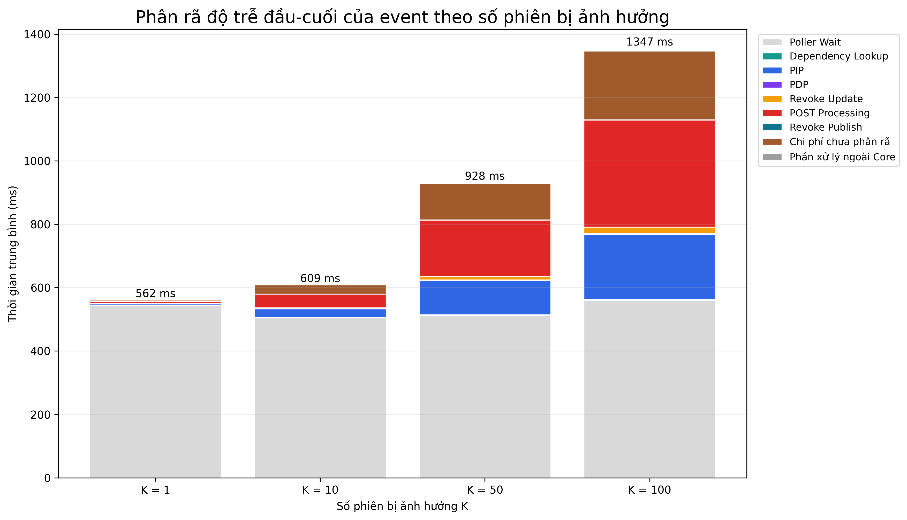
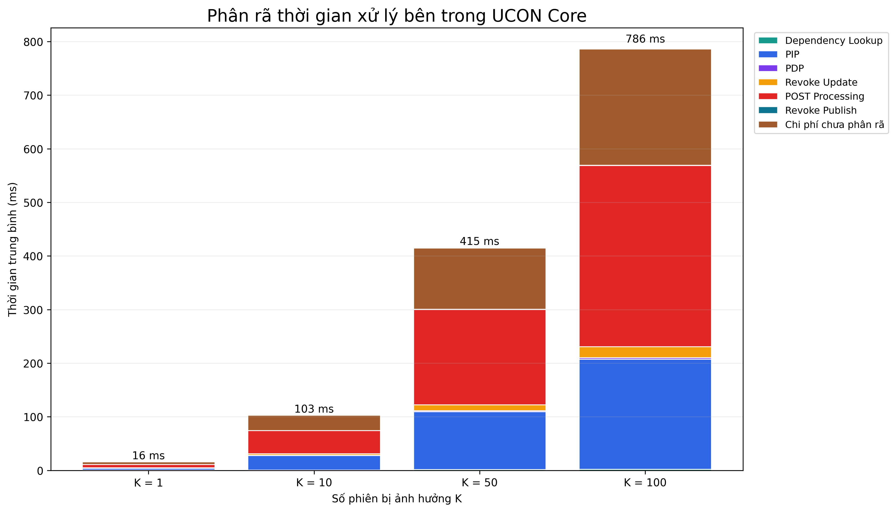
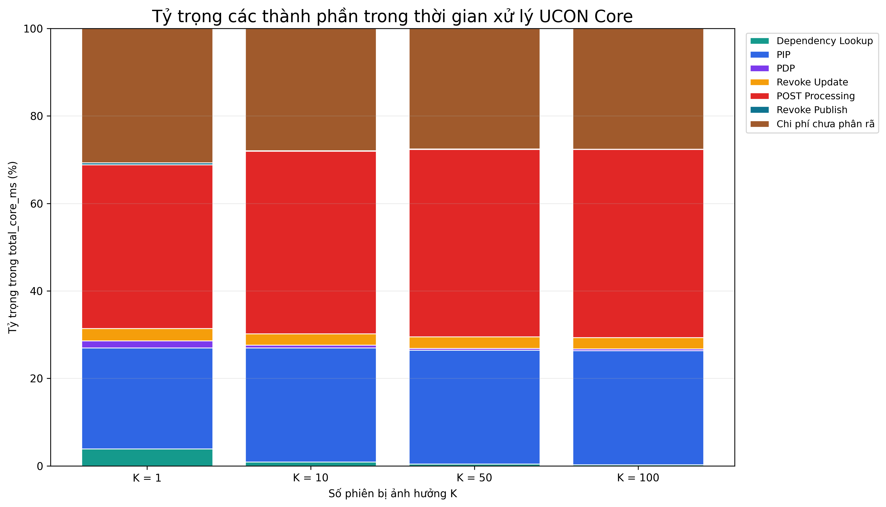
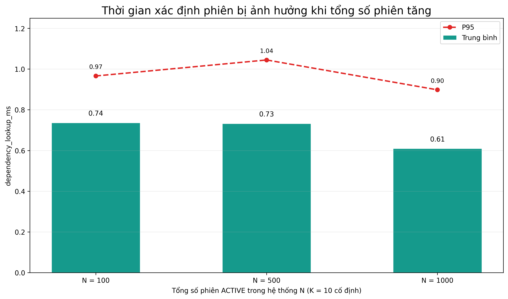
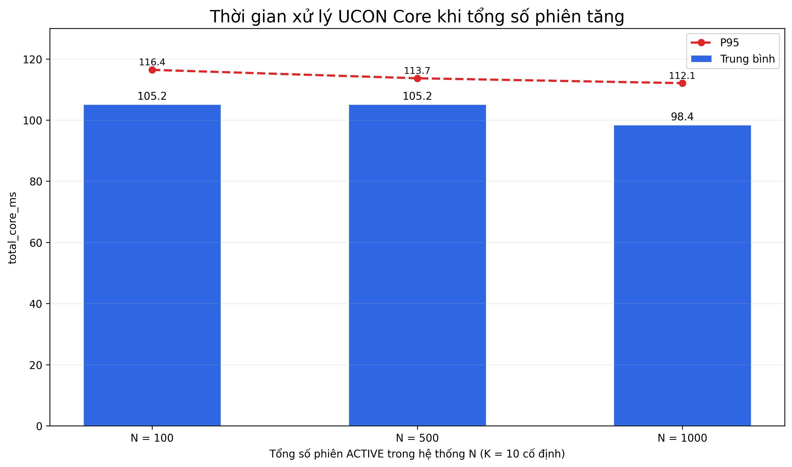
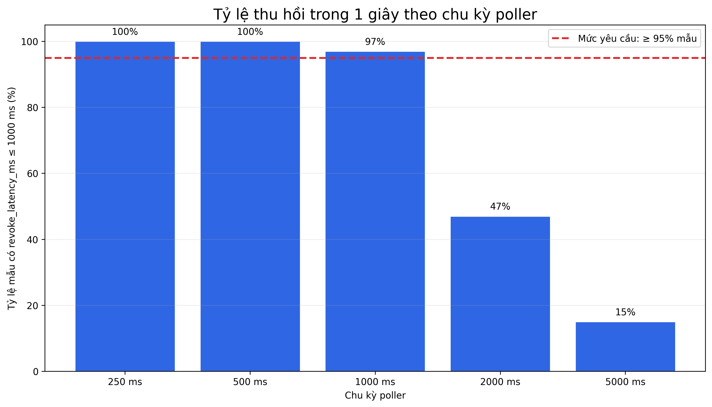
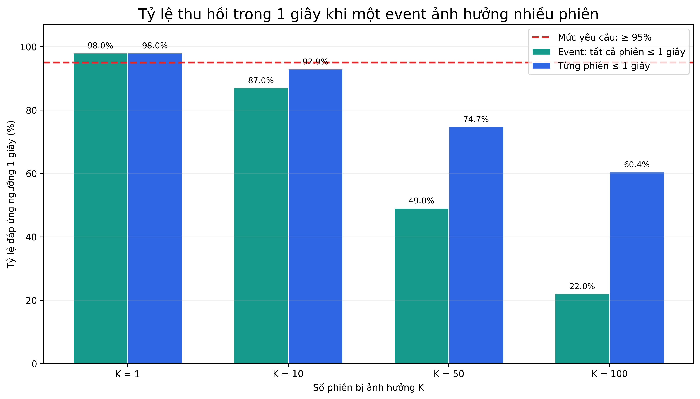
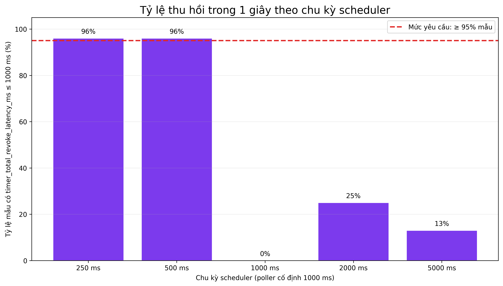
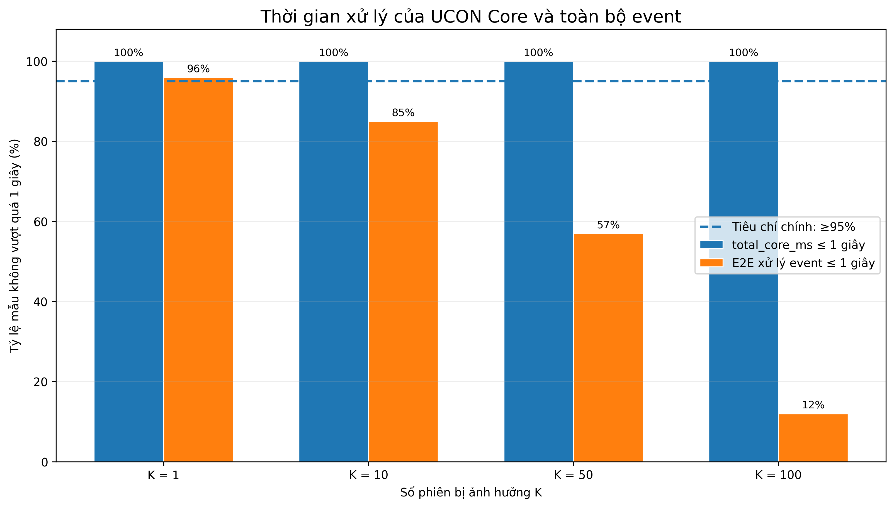
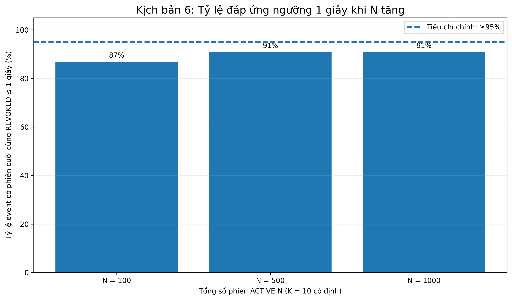

# PHÂN TÍCH KẾT QUẢ UCON CORE SERVICE

## Thông tin thành viên

| MSSV | Họ và tên |
|---|---|
| 22127256 | Ngô Triệu Mẫn |
| 22127117 | Lý Liên Hoa |

---

# PHẦN I. TỔNG QUAN VÀ PHƯƠNG PHÁP PHÂN TÍCH

## 1. Bối cảnh và mục tiêu

Phần đo đạc tập trung đánh giá hiệu năng của cơ chế tái đánh giá liên tục trong nguyên mẫu UCON Core Service. Khi một thuộc tính đang được giám sát thay đổi hoặc một quan hệ phụ thuộc theo thời gian đến hạn, hệ thống cần phát hiện sự kiện, xác định các phiên bị ảnh hưởng, tái đánh giá chính sách và thu hồi các phiên không còn hợp lệ.

Các phép đo tập trung vào các yếu tố chính sau:

- thời gian hệ thống phát hiện một thay đổi cần tái đánh giá;
- chi phí xử lý sau khi sự kiện đã được phát hiện;
- chi phí hoạt động định kỳ của poller và scheduler;
- thành phần nào bên trong UCON Core chiếm nhiều thời gian khi một event ảnh hưởng đến nhiều phiên;
- chi phí xử lý có thay đổi đáng kể hay không khi tổng số phiên đang hoạt động trong hệ thống tăng.

Mục tiêu của phần phân tích không chỉ là tìm cấu hình có độ trễ nhỏ, mà còn xem xét sự đánh đổi giữa tốc độ thu hồi quyền và chi phí xử lý nền. Các phép đo sau cùng tiếp tục phân rã thời gian xử lý bên trong UCON Core và quan sát khả năng mở rộng khi số phiên trong hệ thống tăng.

## 2. Hai cơ chế kích hoạt tái đánh giá

Nguyên mẫu triển khai hai cơ chế chính:

| Cơ chế | Luồng xử lý |
|---|---|
| **Event-driven** | Trạng thái thuộc tính thay đổi → cơ sở dữ liệu tạo sự kiện `ATTRIBUTE_CHANGED` → poller lấy sự kiện → UCON Core tái đánh giá chính sách → phiên không còn hợp lệ chuyển sang `REVOKED`. |
| **Timer-based** | Quan hệ phụ thuộc đến hạn → scheduler tạo sự kiện `TIMER_DUE` → poller lấy sự kiện → UCON Core tái đánh giá chính sách → phiên hết hiệu lực chuyển sang `REVOKED`. |

Trong các biến thời gian được khảo sát, cơ chế event-driven chịu ảnh hưởng trực tiếp từ chu kỳ poller. Với cơ chế timer-based, hệ thống còn phải trải qua bước scheduler phát hiện mốc đến hạn trước khi sự kiện được poller lấy ra xử lý.

## 3. Các kịch bản đo đạc

Các phép đo được tổ chức thành sáu kịch bản chính:

| Kịch bản | Biến khảo sát | Các mức đo | Mục tiêu |
|---|---|---|---|
| **Kịch bản 1: Hủy gói thuê của một phiên** | Chu kỳ poller | `250`, `500`, `1000`, `2000`, `5000` ms | Đánh giá ảnh hưởng của poller đến độ trễ phát hiện và thu hồi. |
| **Kịch bản 2: Quét khi không có sự kiện** | Chu kỳ poller | `250`, `500`, `1000`, `2000`, `5000` ms | Đánh giá tần suất hoạt động nền và số lượt quét rỗng. |
| **Kịch bản 3: Hủy gói thuê của nhiều phiên** | Số phiên bị ảnh hưởng K | `1`, `10`, `50`, `100` phiên | Đánh giá chi phí xử lý khi một event tác động đến nhiều phiên. |
| **Kịch bản 4: Gói thuê hết hạn theo thời gian** | Chu kỳ scheduler | `250`, `500`, `1000`, `2000`, `5000` ms | Đánh giá độ trễ của cơ chế timer-based khi phải đi qua scheduler và poller. |
| **Kịch bản 5: Phân rã chi phí xử lý UCON Core** | Số phiên bị ảnh hưởng K | `1`, `10`, `50`, `100` phiên | Xác định thời gian xử lý được dùng cho những bước nào bên trong UCON Core. |
| **Kịch bản 6: Ảnh hưởng của tổng số phiên đang hoạt động** | Tổng số phiên N, giữ K cố định | `100`, `500`, `1000` phiên; `K = 10` | Kiểm tra chi phí xử lý có tăng đáng kể khi tổng số phiên trong hệ thống tăng hay không. |

Đối với các kịch bản cần thu hồi phiên, hệ thống có giai đoạn warm-up trước khi ghi nhận mẫu chính thức. Các mẫu warm-up không được đưa vào kết quả phân tích.

## 4. Các mốc thời gian và chỉ số chung

### 4.1. Các mốc thời gian

| Mốc | Ý nghĩa |
|---|---|
| `occurred_at` | Thời điểm sự kiện được tạo trong hàng đợi. |
| `picked_at` | Thời điểm poller lấy sự kiện để xử lý. |
| `processed_at` | Thời điểm sự kiện được backend đánh dấu xử lý hoàn tất. |
| `revoked_at` | Thời điểm phiên chuyển sang trạng thái `REVOKED`. |
| `dependency_due_at` | Mốc thời gian quan hệ phụ thuộc cần được kiểm tra, dùng trong kịch bản timer-based. |

### 4.2. Các chỉ số độ trễ chính

| Chỉ số | Ý nghĩa | Cách xác định |
|---|---|---|
| `event_detection_latency_ms` | Thời gian sự kiện chờ poller lấy ra xử lý | `picked_at - occurred_at` |
| `event_processing_latency_ms` | Thời gian backend xử lý sau khi poller đã lấy sự kiện | `processed_at - picked_at` |
| `event_end_to_end_latency_ms` | Tổng thời gian từ lúc sự kiện được tạo đến khi xử lý hoàn tất | `processed_at - occurred_at` |
| `reevaluation_duration_ms` | Thời gian chuẩn bị ngữ cảnh và nhận kết quả đánh giá chính sách của một phiên | lấy từ dữ liệu đo của lần tái đánh giá |
| `revoke_latency_ms` | Thời gian từ lúc sự kiện được tạo đến khi phiên chuyển sang `REVOKED` | `revoked_at - occurred_at` |

Theo định nghĩa:

$$
\texttt{event\_end\_to\_end\_latency\_ms}
=
\texttt{event\_detection\_latency\_ms}
+
\texttt{event\_processing\_latency\_ms}
$$

Đối với một phiên bị thu hồi trong quá trình xử lý sự kiện:

$$
\texttt{revoke\_latency\_ms}
\le
\texttt{event\_end\_to\_end\_latency\_ms}
$$

vì trạng thái phiên có thể được cập nhật sang `REVOKED` trước khi toàn bộ event được đánh dấu `processed_at`.

### 4.3. Ngưỡng tham chiếu để đánh giá tính kịp thời

Các chỉ số latency cho biết cấu hình nào nhanh hơn, nhưng nếu chỉ báo cáo một giá trị như `500 ms` hoặc `1000 ms` thì vẫn chưa đủ cơ sở để kết luận việc thu hồi quyền có **kịp thời** hay không. Vì vậy, bài phân tích bổ sung một mốc tham chiếu để đối chiếu kết quả.

Trong bảng tài liệu tham khảo của nhóm có bốn công trình được xem xét:

- Shneiderman nghiên cứu thời gian phản hồi trong hệ thống tương tác và cho biết người dùng thường ưu tiên thời gian phản hồi **dưới một giây** đối với phần lớn tác vụ.
- Bhattacharya báo cáo end-to-end latency khoảng `150 ms` cho một kiến trúc Zero Trust IoT/WSN có continuous verification.
- Berlato và cộng sự đề xuất phương pháp đánh giá hiệu năng cơ chế Access Control theo các luồng sử dụng thực tế, đồng thời chỉ ra hạn chế của việc chỉ dựa vào micro-benchmark của từng request riêng lẻ.
- Hariri và cộng sự trình bày UCON+ với continuous monitoring và continuous authorization, nhưng không đưa ra một ngưỡng latency số cụ thể để dùng làm tiêu chí đạt hay không đạt.

Từ các tài liệu trên, bài chọn:

```text
Ngưỡng tham chiếu chính = 1000 ms = 1 giây
```

Lý do chọn `1 giây` là đây là mốc có cơ sở từ nghiên cứu về thời gian phản hồi của hệ thống tương tác và phù hợp để diễn giải kết quả ở mức ứng dụng: sau khi điều kiện sử dụng không còn hợp lệ, quyền nên được thu hồi đủ nhanh để thay đổi được phản ánh trong khoảng thời gian ngắn mà người dùng có thể nhận thấy.

Trong bài toán này, mốc `1 giây` không được hiểu là thời gian người dùng chủ động ngồi chờ một thao tác thu hồi hoàn tất. Việc thu hồi quyền thường diễn ra ở nền sau khi một điều kiện sử dụng thay đổi. Nhóm sử dụng mốc này để đánh giá mức độ kịp thời mà thay đổi quyền được phản ánh vào hệ thống. Ví dụ, khi gói thuê bị hủy, một phiên đang sử dụng không nên tiếp tục duy trì quyền quá lâu sau thời điểm điều kiện cho phép đã không còn hợp lệ.

Vì vậy, ý nghĩa của ngưỡng `1 giây` trong bài là **thời gian phản ánh thay đổi quyền ở mức ứng dụng**, không phải thời gian phản hồi của một thao tác giao diện mà người dùng đang trực tiếp chờ.


Cần nhấn mạnh rằng `1 giây` **không phải là một chuẩn UCON bắt buộc** và các công trình UCON được tham khảo không quy định rằng mọi hệ thống UCON phải thu hồi quyền trong một giây. Trong bài này, đây là **ngưỡng tham chiếu do nhóm lựa chọn** để biến các số liệu latency thành một tiêu chí có thể kiểm tra được.

Bài cũng sử dụng tiêu chí sau:

```text
Một cấu hình được xem là đáp ứng ngưỡng tham chiếu
khi ít nhất 95% số lần đo có thời gian thu hồi ≤ 1000 ms.
```

Mức `95%` không lấy trực tiếp từ một paper cụ thể. Đây là tiêu chí vận hành được chọn vì toàn bộ phần thực nghiệm đã sử dụng P95 để quan sát các trường hợp chậm. Nói cách khác, điều kiện trên tương đương với việc P95 của thời gian thu hồi không vượt quá `1 giây`.

Mốc `150 ms` của Bhattacharya chỉ được giữ làm **mốc so sánh nghiêm ngặt hơn**, không dùng làm điều kiện đạt/rớt chính. Nguyên nhân là paper này đo một kiến trúc Zero Trust IoT/WSN khác về phần cứng, workload và đường xử lý. Nếu dùng trực tiếp `150 ms` làm chuẩn bắt buộc cho UCON Core sẽ tạo ra một so sánh không tương đương.

Tài liệu tham chiếu:

- **Shneiderman, B. (1984)**, *Response Time and Display Rate in Human Performance with Computers*, ACM Computing Surveys, 16(3), 265–285. DOI: `10.1145/2514.2517`.
- **Hariri, A. et al. (2023)**, *UCON+: Comprehensive Model, Architecture and Implementation for Usage Control and Continuous Authorization*. DOI: `10.1007/978-3-031-16088-2_10`.
- **Berlato, S., Carbone, R., Ranise, S. (2025)**, *A methodology for the experimental performance evaluation of Access Control enforcement mechanisms based on business processes*, Journal of Information Security and Applications, 93, 104158. DOI: `10.1016/j.jisa.2025.104158`.
- **Bhattacharya, S. (2026)**, *Implementing Zero Trust Architecture (ZTA) in IOT enabled (Wireless Sensor Nodes) WSNs creating a digital blockchain of things*, Discover Networks, 2, 16. DOI: `10.1007/s44354-026-00030-5`.

## 5. Phạm vi dữ liệu và cách tổng hợp

Dữ liệu được sử dụng trong bài phân tích gồm:

- 500 mẫu cho kịch bản 1, tương ứng 100 mẫu ở mỗi mức chu kỳ poller;
- 5 lượt quan sát idle polling, mỗi mức được theo dõi khoảng 300 giây;
- 400 mẫu cho kịch bản 3, tương ứng 100 mẫu ở mỗi mức số phiên;
- 500 mẫu cho kịch bản 4, tương ứng 100 mẫu ở mỗi mức chu kỳ scheduler;
- 400 mẫu cho kịch bản 5, tương ứng 100 lần đo ở mỗi mức `K = 1, 10, 50, 100`;
- 300 mẫu cho kịch bản 6, tương ứng 100 lần đo ở mỗi mức `N = 100, 500, 1000`.

Các mẫu được sử dụng trong phân tích đều có `success=True`. Ở các kịch bản thu hồi quyền, số phiên bị ảnh hưởng thực tế phải đúng với số phiên được thiết lập cho lần đo và các phiên cần thu hồi phải kết thúc ở trạng thái `REVOKED`.

Kết quả chủ yếu được tổng hợp bằng:

- giá trị trung bình (mean), dùng để quan sát xu hướng chung;
- P95, dùng để biểu diễn mức mà khoảng 95% mẫu không vượt quá;
- trung vị và độ lệch chuẩn khi cần kiểm tra mức độ ổn định của dữ liệu.
---

# PHẦN II. KẾT QUẢ VÀ PHÂN TÍCH

# 1. Kịch bản 1: Ảnh hưởng của chu kỳ poller đến độ trễ thu hồi

## 1.1. Thiết lập thí nghiệm

Kịch bản tạo một phiên sử dụng ở trạng thái `ACTIVE` dựa trên một gói thuê còn hiệu lực. Sau đó, trạng thái của gói thuê được chuyển từ `ACTIVE` sang `CANCELLED`, làm cơ sở dữ liệu tạo một sự kiện `ATTRIBUTE_CHANGED`.

Luồng xử lý chính:

```text
Tạo 1 phiên ACTIVE
→ chuyển user_rentals.status: ACTIVE → CANCELLED
→ DB tạo ATTRIBUTE_CHANGED
→ poller lấy sự kiện
→ UCON Core tái đánh giá chính sách
→ phiên chuyển sang REVOKED
```

Chu kỳ poller được thay đổi lần lượt ở các mức:

```text
250 ms
500 ms
1000 ms
2000 ms
5000 ms
```

Mỗi mức được đo 100 mẫu chính thức.

## 1.2. Kết quả

| Chu kỳ poller (ms) | Số mẫu | Phát hiện TB | Phát hiện P95 | Xử lý TB | Xử lý P95 | Toàn trình TB | Toàn trình P95 | Tái đánh giá TB | Tái đánh giá P95 | Thu hồi TB | Thu hồi P95 |
|---:|---:|---:|---:|---:|---:|---:|---:|---:|---:|---:|---:|
| 250 | 100 | 128,0 | 240,4 | 17,7 | 20,4 | 145,7 | 257,4 | 6,39 | 7,91 | 137,5 | 249,5 |
| 500 | 100 | 264,8 | 487,9 | 17,5 | 20,5 | 282,3 | 505,7 | 6,43 | 7,61 | 274,2 | 497,2 |
| 1000 | 100 | 470,3 | 975,1 | 17,4 | 20,5 | 487,8 | 993,1 | 6,30 | 7,59 | 479,5 | 984,5 |
| 2000 | 100 | 1021,8 | 1967,3 | 17,9 | 20,2 | 1039,7 | 1984,2 | 6,39 | 7,71 | 1031,3 | 1976,3 |
| 5000 | 100 | 2695,4 | 4745,8 | 17,3 | 20,2 | 2712,7 | 4763,4 | 6,07 | 7,52 | 2704,3 | 4754,9 |

<figure align="center">
  
  <figcaption><i>Hình 1. Độ trễ phát hiện sự kiện theo chu kỳ poller</i></figcaption>
</figure>

<figure align="center">
  
  <figcaption><i>Hình 2. Độ trễ toàn trình và độ trễ thu hồi theo chu kỳ poller</i></figcaption>
</figure>

## 1.3. Phân tích kết quả

Kết quả cho thấy chu kỳ poller ảnh hưởng trực tiếp đến thời gian hệ thống phát hiện một sự kiện cần tái đánh giá. Khi chu kỳ tăng từ `250 ms` lên `5000 ms`, độ trễ phát hiện trung bình tăng từ `128,0 ms` lên `2695,4 ms`, trong khi P95 tăng từ `240,4 ms` lên `4745,8 ms`.

Giá trị trung bình của độ trễ phát hiện nhìn chung nằm quanh khoảng một nửa chu kỳ poller. Điều này phù hợp với đặc điểm của cơ chế polling: nếu sự kiện xuất hiện ngay trước lần quét tiếp theo thì thời gian chờ ngắn, còn nếu xuất hiện ngay sau khi poller vừa chạy thì phải chờ gần một chu kỳ đầy đủ. Khi quan sát nhiều lần đo với thời điểm phát sinh sự kiện khác nhau, giá trị trung bình có xu hướng nằm gần giữa khoảng chờ đó.

P95 của độ trễ phát hiện lại tiến gần tới chính chu kỳ poller. Ở các trường hợp chậm, event có thể xuất hiện ngay sau khi một lượt quét vừa kết thúc nên phải chờ gần hết interval mới được lấy ra xử lý. Vì vậy, khi interval tăng, phần đuôi của phân bố độ trễ cũng tăng theo.

Ngược lại với detection latency, thời gian xử lý event sau khi poller đã lấy event gần như không thay đổi giữa các cấu hình. Giá trị trung bình chỉ dao động khoảng `17,3–17,9 ms`, còn P95 nằm quanh `20 ms`. Thời gian tái đánh giá một phiên cũng khá ổn định, khoảng `6 ms`.

Điều này cho thấy việc tăng chu kỳ poller chủ yếu làm kéo dài thời gian chờ trước khi UCON Core bắt đầu xử lý, chứ không làm cho phần xử lý nội bộ của event trở nên chậm hơn.

Độ trễ thu hồi và độ trễ đầu-cuối cũng tăng theo chu kỳ poller. Hai giá trị này gần nhau vì phiên được chuyển sang `REVOKED` trong quá trình xử lý event, trước khi event được ghi nhận là hoàn tất tại `processed_at`. Khoảng chênh còn lại chỉ chiếm một phần nhỏ so với thời gian chờ poller.

### Nhận xét

Trong phạm vi phép đo, chu kỳ poller là yếu tố chi phối đáng kể độ trễ phản ứng của cơ chế event-driven. Chu kỳ càng ngắn thì sự kiện được phát hiện và phiên bị thu hồi càng sớm. Tuy nhiên, việc giảm interval cũng làm tăng tần suất hoạt động nền của poller, cần được xem xét cùng với kết quả của kịch bản tiếp theo.

---

# 2. Kịch bản 2: Chi phí polling khi không có sự kiện

## 2.1. Thiết lập thí nghiệm

Kịch bản này quan sát poller trong khoảng thời gian không có event chờ xử lý. Bộ đếm được đặt lại ở đầu mỗi lần đo, hệ thống chạy liên tục trong khoảng thời gian quan sát và ghi nhận tổng số lượt poller chạy, số lượt không tìm thấy event và tần suất chạy theo phút.

Chu kỳ poller vẫn được khảo sát ở năm mức:

```text
250 ms
500 ms
1000 ms
2000 ms
5000 ms
```

Khi không có event:

```text
eventsProcessed = 0
emptyPolls = pollRuns
```

Do poller sử dụng `fixedDelay`, chu kỳ thực tế bao gồm cả thời gian thực thi lượt poll trước và khoảng nghỉ đã cấu hình. Vì vậy, tần suất thực tế có thể thấp hơn giá trị lý thuyết:

$$
\texttt{pollerRunsPerMinute}
\le
\frac{60000}{\texttt{pollerIntervalMs}}
$$

## 2.2. Kết quả

| Chu kỳ (ms) | Lần quét/phút | Quét rỗng/phút | Lý thuyết/phút | Chu kỳ thực (ms) | Tỷ lệ đạt (%) |
|---:|---:|---:|---:|---:|---:|
| 250 | 233,59 | 233,59 | 240,0 | 256,86 | 97,33 |
| 500 | 117,59 | 117,59 | 120,0 | 510,24 | 97,99 |
| 1000 | 59,40 | 59,40 | 60,0 | 1010,16 | 98,99 |
| 2000 | 29,80 | 29,80 | 30,0 | 2013,56 | 99,33 |
| 5000 | 12,00 | 12,00 | 12,0 | 5000,35 | 99,99 |

<figure align="center">
  
  <figcaption><i>Hình 3. Chi phí thăm dò khi không có sự kiện</i></figcaption>
</figure>

## 2.3. Phân tích kết quả

Khi chu kỳ poller ngắn, số lượt quét nền tăng mạnh. Với interval `250 ms`, hệ thống thực hiện khoảng `233,59` lượt quét mỗi phút. Ở mức `1000 ms`, số lượt giảm xuống khoảng `59,40` lượt/phút và ở `5000 ms` chỉ còn khoảng `12` lượt/phút.

Trong phép đo không có event, toàn bộ các lượt poll đều là quét rỗng. Vì vậy, việc giảm interval để có phản ứng nhanh hơn đồng thời làm tăng số lần backend phải truy vấn hàng đợi sự kiện dù không có công việc cần xử lý.

Số lượt chạy thực tế thấp hơn nhẹ so với lý thuyết ở các interval nhỏ. Nguyên nhân phù hợp với cơ chế `fixedDelay`: sau khi một lần poll hoàn thành, scheduler mới bắt đầu tính khoảng nghỉ trước lượt tiếp theo. Chi phí thực thi mỗi lần poll vì vậy làm chu kỳ thực tế dài hơn một ít so với interval cấu hình.

### Nhận xét

Kịch bản 1 và kịch bản 2 cho thấy một sự đánh đổi rõ ràng. Interval ngắn làm giảm độ trễ phát hiện và thu hồi, nhưng làm tăng hoạt động nền khi hệ thống không có event. Ngược lại, interval dài giảm số lượt quét rỗng nhưng làm event phải chờ lâu hơn trước khi được xử lý.

---

# 3. Lựa chọn chu kỳ poller đại diện

Để trực quan hóa sự đánh đổi giữa độ trễ thu hồi và chi phí polling nền, P95 của độ trễ thu hồi và số lượt quét rỗng mỗi phút được chuẩn hóa về cùng một thang đo.

| Chu kỳ (ms) | Phát hiện P95 | Thu hồi P95 | Quét rỗng/phút | Thu hồi chuẩn hóa | Quét rỗng chuẩn hóa | Độ lệch | Điểm cân bằng |
|---:|---:|---:|---:|---:|---:|---:|---:|
| 250 | 240,4 | 249,5 | 233,59 | 0,0525 | 1,0000 | 0,9475 | 1,0525 |
| 500 | 487,9 | 497,2 | 117,59 | 0,1046 | 0,5034 | 0,3988 | 0,6080 |
| 1000 | 975,1 | 984,5 | 59,40 | 0,2070 | 0,2543 | 0,0472 | 0,4613 |
| 2000 | 1967,3 | 1976,3 | 29,80 | 0,4156 | 0,1276 | 0,2881 | 0,5432 |
| 5000 | 4745,8 | 4754,9 | 12,00 | 1,0000 | 0,0514 | 0,9486 | 1,0514 |

<figure align="center">
  
  <figcaption><i>Hình 4. Sự đánh đổi giữa độ trễ thu hồi và số lượt quét rỗng</i></figcaption>
</figure>

Trong tập các mức đã khảo sát, `1000 ms` nằm gần vùng mà hai yếu tố có mức tương đối cân bằng hơn so với các interval còn lại. Giá trị này không được xem là một optimum chung cho mọi hệ thống, mà chỉ được sử dụng như một cấu hình đại diện cho các phép đo tiếp theo trong bộ dữ liệu hiện tại.

---

# 4. Kịch bản 3: Ảnh hưởng của số phiên bị tác động

## 4.1. Thiết lập thí nghiệm

Chu kỳ poller được giữ cố định ở `1000 ms`. Hệ thống tạo đồng thời nhiều phiên `ACTIVE` cùng phụ thuộc vào một gói thuê. Số phiên được thay đổi theo:

```text
K = 1
K = 10
K = 50
K = 100
```

Sau khi tất cả phiên đã được kích hoạt, trạng thái của gói thuê được chuyển từ `ACTIVE` sang `CANCELLED`.

Luồng xử lý:

```text
Tạo K phiên ACTIVE cùng phụ thuộc một gói thuê
→ đổi trạng thái gói thuê ACTIVE → CANCELLED
→ DB tạo một ATTRIBUTE_CHANGED
→ poller lấy event
→ xác định K phiên liên quan
→ tái đánh giá từng phiên
→ các phiên không còn hợp lệ chuyển sang REVOKED
```

Một iteration chỉ được xem là hợp lệ khi số phiên bị ảnh hưởng và số phiên bị thu hồi bằng đúng số phiên được yêu cầu.

## 4.2. Các chỉ số chính

Ngoài `event_processing_latency_ms`, kịch bản sử dụng thêm:

$$
\texttt{reevaluation\_total\_ms}
=
\sum_{i=1}^{K} r_i
$$

với \(r_i\) là thời gian tái đánh giá của phiên thứ \(i\).

Thời gian tái đánh giá trung bình trên mỗi phiên:

$$
\texttt{reevaluation\_mean\_ms}
=
\frac{\texttt{reevaluation\_total\_ms}}{K}
$$

Phần chi phí xử lý còn lại ngoài tổng thời gian tái đánh giá:

$$
\texttt{non\_reevaluation\_overhead\_ms}
=
\texttt{event\_processing\_latency\_ms}
-
\texttt{reevaluation\_total\_ms}
$$

Chỉ số này chỉ là phần chênh ở mức tổng hợp. Nó chưa cho biết chi tiết phần thời gian còn lại thuộc Dependency Lookup, cập nhật trạng thái, xử lý POST, ghi dữ liệu hay các bước điều phối khác.

## 4.3. Kết quả

| Số phiên | Số mẫu | Xử lý TB | Xử lý P95 | Xử lý lớn nhất | Tổng tái đánh giá TB | Tổng tái đánh giá P95 | Tái đánh giá/phiên | Chi phí ngoài tái đánh giá | Thu hồi P95 TB | Thu hồi lớn nhất TB | Độ chênh TB | Độ chênh P95 |
|---:|---:|---:|---:|---:|---:|---:|---:|---:|---:|---:|---:|---:|
| 1 | 100 | 18,3 | 21,2 | 24,4 | 6,6 | 7,8 | 6,617 | 11,7 | 525,3 | 525,3 | 0,0 | 0,0 |
| 10 | 100 | 107,7 | 118,7 | 123,9 | 41,2 | 46,1 | 4,122 | 66,5 | 566,0 | 569,9 | 42,6 | 47,2 |
| 50 | 100 | 414,1 | 436,2 | 452,7 | 158,3 | 168,2 | 3,167 | 255,7 | 937,2 | 955,8 | 188,0 | 202,2 |
| 100 | 100 | 789,5 | 834,3 | 1010,3 | 300,1 | 323,4 | 3,001 | 489,4 | 1239,3 | 1276,5 | 374,3 | 393,7 |

<figure align="center">
  
  <figcaption><i>Hình 5. Thời gian xử lý khi số phiên bị ảnh hưởng tăng</i></figcaption>
</figure>

<figure align="center">
  
  <figcaption><i>Hình 6. Độ chênh thời gian thu hồi giữa các phiên</i></figcaption>
</figure>

## 4.4. Phân tích kết quả

Kết quả cho thấy thời gian UCON Core xử lý một event tăng rõ rệt khi số phiên bị ảnh hưởng tăng. Thời gian xử lý trung bình tăng từ `18,3 ms` ở mức một phiên lên `107,7 ms` với 10 phiên, `414,1 ms` với 50 phiên và `789,5 ms` với 100 phiên. P95 cũng tăng từ `21,2 ms` lên `834,3 ms`.

Xu hướng này cho thấy sau khi event đã được poller lấy ra, số lượng phiên liên quan trở thành một yếu tố quan trọng đối với chi phí xử lý. Mỗi phiên cần được lấy thông tin cần thiết, tái đánh giá chính sách và thực hiện các bước xử lý tiếp theo nếu quyết định không còn cho phép.

Tổng thời gian tái đánh giá cũng tăng theo K, từ trung bình `6,6 ms` ở mức một phiên lên `300,1 ms` ở mức 100 phiên. Đây là xu hướng phù hợp với việc hệ thống phải thực hiện thêm một lần reevaluation cho mỗi phiên bị ảnh hưởng.

Tuy nhiên, thời gian tái đánh giá trung bình trên từng phiên lại giảm từ `6,617 ms` xuống còn khoảng `3,001 ms`. Dữ liệu cho thấy việc xử lý nhiều phiên liên tiếp trong cùng event có thể làm giảm một số chi phí cố định trên từng phiên. Tuy nhiên, phép đo hiện tại chưa tách chi tiết các thành phần bên trong reevaluation nên chưa đủ cơ sở để xác định chính xác nguyên nhân.

Phần `non_reevaluation_overhead_ms` cũng tăng mạnh, từ `11,7 ms` ở mức một phiên lên `489,4 ms` ở mức 100 phiên. Phần này có thể bao gồm các công việc như xác định phiên bị ảnh hưởng, lấy dữ liệu phiên, cập nhật trạng thái, ghi dữ liệu, xử lý sau sử dụng và hoàn tất event. Vì đây chỉ là hiệu số giữa hai metric tổng hợp, không nên xem nó như một bước xử lý độc lập.

Trong phạm vi các mức K đã khảo sát, thời gian xử lý event và tổng reevaluation có xu hướng tăng gần tuyến tính khi K tăng. Tuy nhiên, benchmark này chỉ cho thấy xu hướng thực nghiệm tại các mức đã đo, không dùng để kết luận độ phức tạp thuật toán theo nghĩa toán học.

## 4.5. Độ chênh thời gian thu hồi giữa các phiên

Khi một event tác động đến nhiều phiên, các phiên không được hoàn tất tại cùng một thời điểm. Phiên được xử lý sớm hơn có thể chuyển sang `REVOKED` trước phiên nằm ở cuối chuỗi xử lý.

Độ chênh trung bình tăng từ `0 ms` ở K=1 lên khoảng `42,6 ms` ở K=10, `188,0 ms` ở K=50 và `374,3 ms` ở K=100. Điều này phản ánh tác động của cách xử lý nhiều phiên trong cùng một event: khi K tăng, khoảng thời gian giữa các phiên hoàn tất sớm và muộn cũng tăng.

### Nhận xét

Kịch bản 3 xác nhận rằng một event ảnh hưởng đến càng nhiều phiên thì tổng chi phí xử lý càng lớn. Tuy nhiên, phép đo này mới chỉ cho biết tổng processing time, tổng reevaluation và phần chênh ngoài reevaluation. Nó chưa trả lời được thành phần nào bên trong UCON Core chiếm tỷ trọng lớn nhất.

Đây là hạn chế quan trọng của phép đo cũ và là cơ sở để thực hiện một kịch bản phân rã chi tiết hơn ở bước tiếp theo.

---

# 5. Kịch bản 4: Ảnh hưởng của chu kỳ scheduler trong cơ chế timer-based

## 5.1. Thiết lập thí nghiệm

Kịch bản tạo một gói thuê có thời điểm hết hạn gần thời điểm thực hiện phép đo, sau đó tạo một phiên `ACTIVE` phụ thuộc vào mốc hết hạn đó.

Luồng xử lý:

```text
Gói thuê đến hạn
→ dependency next_check_at đến hạn
→ scheduler phát hiện
→ scheduler tạo TIMER_DUE
→ poller lấy TIMER_DUE
→ UCON Core tái đánh giá
→ phiên chuyển sang REVOKED
```

Chu kỳ poller được giữ cố định ở `1000 ms`. Chu kỳ scheduler được thay đổi ở các mức `250`, `500`, `1000`, `2000` và `5000 ms`. Mỗi mức được đo 100 mẫu.

## 5.2. Các thành phần độ trễ

Đối với timer-based, tổng độ trễ thu hồi có thể hiểu theo ba phần chính:

```text
mốc hết hạn
→ chờ scheduler phát hiện
→ chờ poller lấy TIMER_DUE
→ UCON Core xử lý và thu hồi
```

Trong đó:

- `timer_detection_latency_ms`: từ `dependency_due_at` đến lúc scheduler tạo event;
- `timer_event_detection_latency_ms`: thời gian event `TIMER_DUE` chờ poller;
- `timer_event_processing_latency_ms`: thời gian backend xử lý sau khi poller lấy event;
- `timer_total_revoke_latency_ms`: từ mốc đến hạn đến lúc session chuyển `REVOKED`.

## 5.3. Kết quả

| Chu kỳ scheduler (ms) | Số mẫu | Phát hiện hạn TB | Phát hiện hạn P95 | Poller lấy event TB | Poller lấy event P95 | Xử lý TB | Xử lý P95 | Tổng thu hồi TB | Tổng thu hồi P95 | Tái đánh giá TB | Tái đánh giá P95 |
|---:|---:|---:|---:|---:|---:|---:|---:|---:|---:|---:|---:|
| 250 | 100 | 137,2 | 248,8 | 746,7 | 909,2 | 18,4 | 21,1 | 893,9 | 994,4 | 6,69 | 7,92 |
| 500 | 100 | 282,6 | 486,2 | 457,5 | 832,8 | 18,6 | 21,1 | 750,1 | 992,0 | 6,74 | 7,92 |
| 1000 | 100 | 452,5 | 946,0 | 1009,4 | 1014,1 | 18,2 | 21,2 | 1471,3 | 1967,2 | 6,50 | 7,68 |
| 2000 | 100 | 1030,7 | 1963,6 | 471,5 | 923,4 | 18,6 | 21,5 | 1512,2 | 2390,3 | 6,69 | 7,80 |
| 5000 | 100 | 2180,6 | 4710,9 | 476,0 | 932,7 | 18,3 | 20,8 | 2666,3 | 5286,7 | 6,58 | 7,64 |

<figure align="center">
  
  <figcaption><i>Hình 7. Độ trễ thu hồi theo chu kỳ scheduler</i></figcaption>
</figure>

<figure align="center">
  
  <figcaption><i>Hình 8. Tương tác thời điểm thực thi giữa scheduler và poller</i></figcaption>
</figure>

## 5.4. Phân tích kết quả

Độ trễ để scheduler phát hiện mốc đến hạn tăng khi scheduler interval tăng. P95 của `timer_detection_latency_ms` tăng từ khoảng `248,8 ms` ở chu kỳ `250 ms` lên `4710,9 ms` ở chu kỳ `5000 ms`.

Khi scheduler phát hiện dependency đến hạn, event `TIMER_DUE` vẫn chưa được xử lý ngay mà phải chờ poller lấy ra. Vì poller được cố định ở `1000 ms`, phần chờ này có thể tiếp tục đóng góp gần một giây vào tổng latency.

Trường hợp đáng chú ý nhất là khi scheduler và poller đều có chu kỳ `1000 ms`. Ở mức này, thời gian event chờ poller trung bình khoảng `1009,4 ms` và P95 khoảng `1014,1 ms`, tức gần trọn một chu kỳ poller. Kết quả cho thấy thời điểm scheduler tạo event có thể rơi vào vị trí không thuận lợi so với lần quét của poller, làm event phải chờ gần một interval đầy đủ mới được lấy ra.

Do đó, P95 của tổng độ trễ thu hồi tại scheduler `1000 ms` tăng lên gần `1967,2 ms`. Ngược lại, tại scheduler `500 ms`, P95 tổng thu hồi chỉ khoảng `992,0 ms`.

Ở các mức scheduler `2000 ms` và `5000 ms`, thời gian event chờ poller trung bình quay về khoảng `472–476 ms`, gần một nửa chu kỳ poller. Tuy nhiên, P95 vẫn đạt hơn `900 ms`, cho thấy ở các mẫu chậm event vẫn có thể phải chờ gần lần poll tiếp theo.

Một điểm quan trọng là thời gian processing bên trong backend gần như không đổi giữa các cấu hình, chỉ khoảng `18 ms`, còn reevaluation khoảng `6,5–6,7 ms`. Như vậy, phần tăng của tổng latency chủ yếu đến từ hai tầng chờ định kỳ: scheduler và poller, không phải vì UCON Core xử lý policy chậm hơn khi scheduler interval thay đổi.

### Nhận xét

Độ trễ của cơ chế timer-based phụ thuộc đồng thời vào chu kỳ scheduler và chu kỳ poller. Hai tham số này cần được xem xét phối hợp thay vì cấu hình độc lập. Trong bộ dữ liệu này, cấu hình scheduler `500 ms` kết hợp poller `1000 ms` cho kết quả tổng latency tốt hơn trường hợp hai chu kỳ cùng `1000 ms`.

---

# 6. Khoảng thời gian hoàn tất sau khi phiên bị thu hồi

Sau khi phiên chuyển sang trạng thái `REVOKED`, UCON Core vẫn cần một khoảng thời gian nhỏ để hoàn tất các bước còn lại của event trước khi ghi nhận `processed_at`.

| Chỉ số | Giá trị (ms) |
|---|---:|
| Trung bình | 8,586 |
| Trung vị | 8,558 |
| P95 | 10,245 |
| Nhỏ nhất | 4,533 |
| Lớn nhất | 18,360 |

<figure align="center">
  
  <figcaption><i>Hình 9. Khoảng thời gian hoàn tất sau khi phiên chuyển sang REVOKED</i></figcaption>
</figure>

Khoảng thời gian này trung bình khoảng `8,59 ms` và P95 khoảng `10,25 ms`. So với các khoảng chờ scheduler và poller, đây là phần tương đối nhỏ.

Chu kỳ scheduler ảnh hưởng đến thời điểm event bắt đầu được xử lý, nhưng gần như không làm thay đổi phần thời gian hoàn tất sau khi session đã chuyển sang `REVOKED`.

---

# 7. Phân tích bổ sung: ảnh hưởng của xử lý POST

Bộ dữ liệu cũ có thêm phép so sánh trước và sau khi bật xử lý `postUpdate`.

<figure align="center">
  
  <figcaption><i>Hình 10. Thời gian xử lý một phiên trước và sau khi bật postUpdate</i></figcaption>
</figure>

<figure align="center">
  
  <figcaption><i>Hình 11. Thời gian xử lý nhiều phiên trước và sau khi bật postUpdate</i></figcaption>
</figure>

<figure align="center">
  
  <figcaption><i>Hình 12. Khoảng hoàn tất sau thu hồi trước và sau khi bật postUpdate</i></figcaption>
</figure>

Kết quả cho thấy thời gian processing tăng sau khi bổ sung `postUpdate`. Trong trường hợp một phiên, mức tăng khoảng `5–6 ms` và tương đối ổn định giữa các chu kỳ poller.

Khi số phiên bị ảnh hưởng tăng, phần chênh trở nên rõ hơn. Ở mức 100 phiên, thời gian xử lý trung bình tăng từ khoảng `503,3 ms` trước khi bật `postUpdate` lên `789,5 ms` sau khi bật.

Khoảng thời gian từ khi session chuyển sang `REVOKED` đến khi event được đánh dấu xử lý hoàn tất cũng tăng từ khoảng `2,71 ms` lên `8,59 ms`.

Tuy nhiên, không thể xem toàn bộ phần chênh lệch này là thời gian thực thi riêng của `postUpdate`. Khoảng đo còn bao gồm các bước khác như cập nhật trạng thái, ghi dữ liệu, điều phối xử lý và hoàn tất giao dịch. Vì vậy, kết quả chỉ cho thấy việc bổ sung xử lý hậu sử dụng làm tăng tổng chi phí event, đặc biệt khi một event ảnh hưởng đến nhiều phiên.

### Nhận xét

Phép so sánh before/after cho thấy POST processing là một yếu tố cần được quan tâm, nhưng dữ liệu cũ chưa đủ chi tiết để xác định chính xác phần thời gian nào thuộc đánh giá chính sách POST, cập nhật thuộc tính hay các thao tác khác.

---

# 8. Kịch bản 5: Phân rã chi phí xử lý bên trong UCON Core

## 8.1. Thiết lập thí nghiệm

Kịch bản 3 cho thấy thời gian xử lý tăng khi một event ảnh hưởng đến nhiều phiên, nhưng chưa cho biết phần thời gian đó được dùng ở bước nào. Kịch bản 5 tiếp tục đo cùng loại sự kiện nhưng bổ sung các điểm đo chi tiết bên trong UCON Core.

Cấu hình được giữ cố định:

```text
poller interval    = 1000 ms
scheduler interval = 500 ms
sự kiện            = user_rentals.status: ACTIVE → CANCELLED
```

Số phiên bị ảnh hưởng được thay đổi theo:

```text
K = 1
K = 10
K = 50
K = 100
```

Mỗi mức K được đo 100 lần. Các lần đo này được thực hiện thành hai đợt, mỗi đợt 50 lần. Như vậy, toàn bộ kịch bản có 400 lần đo.

Phạm vi của kịch bản dừng ở phía backend/UCON Core. Thời gian WebSocket gửi thông báo sau khi transaction hoàn tất và thời gian UI phản ứng không nằm trong phép đo này.

## 8.2. Các chỉ số chính

`poller_wait_ms` là thời gian event chờ trước khi poller lấy ra xử lý:

```text
poller_wait_ms = picked_at - occurred_at
```

`event_processing_latency_ms` là thời gian backend xử lý sau khi poller đã lấy event:

```text
event_processing_latency_ms = processed_at - picked_at
```

`event_end_to_end_latency_ms` là tổng thời gian từ lúc event được tạo đến khi backend xử lý xong:

```text
event_end_to_end_latency_ms
= poller_wait_ms + event_processing_latency_ms
```

Riêng phần xử lý bên trong UCON Core được đo bằng `total_core_ms`. Chỉ số này không bao gồm thời gian chờ poller.

Các thành phần được tách riêng gồm:

| Thành phần | Ý nghĩa |
|---|---|
| `dependency_lookup_ms` | Thời gian xác định các phiên bị ảnh hưởng bởi event. |
| `pip_fetch_ms` | Thời gian PIP lấy các thuộc tính cần thiết. |
| `pdp_evaluate_ms` | Thời gian PDP đánh giá chính sách ONGOING. |
| `revoke_update_ms` | Thời gian cập nhật phiên sang trạng thái `REVOKED`. |
| `post_processing_ms` | Thời gian xử lý POST sau khi quyền sử dụng không còn hợp lệ. |
| `revoke_publish_ms` | Thời gian phát sự kiện thu hồi nội bộ trong backend. |
| `unattributed_core_ms` | Phần thời gian còn lại bên trong UCON Core nhưng chưa được tách thành điểm đo riêng. |

Quan hệ giữa các chỉ số:

```text
total_core_ms
= measured_component_sum_ms + unattributed_core_ms
```

Trong đó `measured_component_sum_ms` là tổng của Dependency Lookup, PIP, PDP, Revoke Update, POST Processing và Revoke Publish.

`reevaluation_total_ms` vẫn được ghi lại để đối chiếu với các phép đo trước, nhưng không cộng vào bảng phân rã trên vì nó đã bao gồm một phần thời gian PIP, PDP và các bước khác của reevaluation.

## 8.3. Kết quả

Toàn bộ 400 lần đo đều có `success=True`. Ở từng lần đo, số phiên thực tế được xác định là bị ảnh hưởng bằng đúng giá trị K đã thiết lập và các phiên tương ứng đều kết thúc ở trạng thái `REVOKED`.

Bảng dưới đây tổng hợp các chỉ số thời gian chính:

| K | Poller Wait TB | Event Processing TB | total_core TB | total_core P95 | E2E TB |
|---:|---:|---:|---:|---:|---:|
| 1 | 544,97 | 16,74 | 16,13 | 19,38 | 561,71 |
| 10 | 505,52 | 103,72 | 103,21 | 116,94 | 609,24 |
| 50 | 512,87 | 415,57 | 415,03 | 435,69 | 928,45 |
| 100 | 560,09 | 786,84 | 786,27 | 818,21 | 1346,93 |

<figure align="center">
  
  <figcaption><i>Hình 13. Phân rã độ trễ đầu-cuối của event theo số phiên bị ảnh hưởng</i></figcaption>
</figure>

Hình 13 cho thấy phần màu xám là thời gian nằm ngoài `total_core_ms`, còn các phần có màu là các thành phần bên trong UCON Core. Khi K nhỏ, phần lớn thời gian đầu-cuối là thời gian chờ poller. Khi K tăng, phần xử lý bên trong UCON Core tăng nhanh và trở thành phần lớn hơn của tổng thời gian.

Mặc dù poller interval luôn giữ ở `1000 ms`, Poller Wait trung bình dao động khoảng `505–560 ms`. Sự chênh lệch này chủ yếu do event có thể xuất hiện ở những thời điểm khác nhau trong chu kỳ polling, không phải do K làm poller xử lý chậm hơn.

Bảng dưới đây chỉ xét riêng thời gian bên trong UCON Core:

| K | Dependency Lookup | PIP | PDP | Revoke Update | POST Processing | Revoke Publish | Chưa phân rã | total_core TB |
|---:|---:|---:|---:|---:|---:|---:|---:|---:|
| 1 | 0,63 | 3,72 | 0,25 | 0,46 | 6,03 | 0,08 | 4,95 | 16,13 |
| 10 | 0,95 | 26,90 | 0,65 | 2,67 | 43,10 | 0,14 | 28,81 | 103,21 |
| 50 | 1,85 | 107,97 | 1,80 | 10,79 | 177,93 | 0,44 | 114,25 | 415,03 |
| 100 | 2,19 | 205,18 | 2,98 | 20,45 | 337,94 | 0,76 | 216,78 | 786,27 |

<figure align="center">
  
  <figcaption><i>Hình 14. Phân rã thời gian xử lý bên trong UCON Core</i></figcaption>
</figure>

<figure align="center">
  
  <figcaption><i>Hình 15. Tỷ trọng các thành phần trong total_core_ms</i></figcaption>
</figure>

## 8.4. Phân tích kết quả

`total_core_ms` tăng rõ rệt khi K tăng, từ trung bình `16,13 ms` ở K=1 lên `786,27 ms` ở K=100. P95 cũng tăng theo cùng xu hướng, từ `19,38 ms` lên `818,21 ms`. Điều này cho thấy khi một event ảnh hưởng đến nhiều phiên, lượng công việc phải thực hiện bên trong UCON Core trở thành phần đáng kể của tổng độ trễ.

Khi phân rã `total_core_ms`, ba phần lớn nhất ở K=100 là:

```text
POST Processing   ≈ 337,94 ms
Chưa phân rã      ≈ 216,78 ms
PIP               ≈ 205,18 ms
```

Ba phần này chiếm khoảng `97%` thời gian xử lý Core ở K=100. Từ K=10 trở lên, tỷ trọng của chúng cũng khá ổn định: POST Processing khoảng `42–43%`, PIP khoảng `26%` và phần chưa phân rã khoảng `27–28%`.

Ngược lại, `pdp_evaluate_ms` chỉ khoảng `2,98 ms` ở K=100, tương đương chưa tới `0,5%` `total_core_ms`. Điều này cho thấy trong kịch bản đo hiện tại, phần đánh giá chính sách của PDP chiếm tỷ trọng nhỏ so với các bước lấy dữ liệu và xử lý sau đánh giá. Kết quả này chỉ áp dụng cho workload và policy được sử dụng trong phép đo, không dùng để kết luận PDP luôn có chi phí nhỏ trong mọi trường hợp.

`dependency_lookup_ms` cũng nhỏ so với tổng thời gian. Giá trị trung bình tăng từ `0,63 ms` ở K=1 lên `2,19 ms` ở K=100. Vì vậy, trong kịch bản này, bước xác định danh sách phiên bị ảnh hưởng không phải là phần làm tổng thời gian tăng mạnh khi K lớn.

`unattributed_core_ms` vẫn nằm bên trong UCON Core. Đây là phần thời gian chưa được đặt điểm đo riêng, có thể gồm các bước điều phối của `ContextHandler`, một số thao tác của `UsageSessionManager`, lấy thông tin session hoặc policy, dựng context, ghi `session_events` và các thao tác cơ sở dữ liệu phụ trợ.

### Nhận xét

Kịch bản 5 làm rõ giới hạn của kịch bản 3. Khi số phiên bị ảnh hưởng tăng, chi phí không tập trung ở riêng bước đánh giá policy. Phần thời gian lớn nhất nằm ở POST Processing, PIP và các thao tác Core chưa được tách riêng.

Ngoài ra, ảnh hưởng của Poller Wait thay đổi về mặt tỷ trọng. Ở K=1, Poller Wait chiếm gần như toàn bộ thời gian đầu-cuối; ở K=100, thời gian xử lý UCON Core đã lớn hơn thời gian chờ poller. Vì vậy, với event ảnh hưởng nhiều phiên, giảm poller interval thôi chưa đủ để giảm mạnh tổng độ trễ.

---

# 9. Kịch bản 6: Ảnh hưởng của tổng số phiên đang hoạt động

## 9.1. Thiết lập thí nghiệm

Kịch bản 5 thay đổi số phiên bị ảnh hưởng K. Kịch bản 6 giữ K cố định và thay đổi tổng số phiên đang hoạt động trong hệ thống để xem chi phí xử lý có tăng theo tổng số phiên hay không.

Cấu hình được giữ cố định:

```text
poller interval    = 1000 ms
scheduler interval = 500 ms
K                   = 10 phiên bị ảnh hưởng
```

Tổng số phiên `ACTIVE` được thay đổi theo:

```text
N = 100
N = 500
N = 1000
```

Trong mỗi lần đo, đúng 10 phiên phụ thuộc vào gói thuê được hủy. Các phiên còn lại chỉ đóng vai trò phiên nền và không phụ thuộc vào gói thuê đó.

Ví dụ:

```text
N = 100  → 10 phiên mục tiêu + 90 phiên nền
N = 500  → 10 phiên mục tiêu + 490 phiên nền
N = 1000 → 10 phiên mục tiêu + 990 phiên nền
```

Mỗi mức N được đo 100 lần, tổng cộng 300 lần đo.

Một lần đo chỉ được xem là hợp lệ khi trước sự kiện có đúng N phiên `ACTIVE`, hệ thống xác định đúng 10 phiên bị ảnh hưởng, 10 phiên đó chuyển sang `REVOKED` và các phiên nền vẫn giữ trạng thái `ACTIVE`.

## 9.2. Kết quả

Toàn bộ 300 lần đo đều có `success=True` và hệ thống xác định đúng 10 phiên bị ảnh hưởng ở cả ba mức N.

Hai chỉ số chính được dùng để đánh giá kịch bản này là:

- `dependency_lookup_ms`: thời gian tìm ra các phiên liên quan đến event;
- `total_core_ms`: tổng thời gian UCON Core xử lý event sau khi poller đã lấy event.

| Tổng số phiên N | Phiên nền | Dependency Lookup TB | Dependency Lookup P95 | total_core TB | total_core P95 |
|---:|---:|---:|---:|---:|---:|
| 100 | 90 | 0,736 | 0,966 | 105,20 | 116,42 |
| 500 | 490 | 0,733 | 1,045 | 105,21 | 113,68 |
| 1000 | 990 | 0,610 | 0,898 | 98,43 | 112,08 |

<figure align="center">
  
  <figcaption><i>Hình 16. Thời gian xác định phiên bị ảnh hưởng khi N tăng và K được giữ cố định</i></figcaption>
</figure>

<figure align="center">
  
  <figcaption><i>Hình 17. total_core_ms khi N tăng và K được giữ cố định</i></figcaption>
</figure>

## 9.3. Phân tích kết quả

Khi N tăng từ 100 lên 1000, `dependency_lookup_ms` trung bình không tăng. Giá trị đo được lần lượt là `0,736 ms`, `0,733 ms` và `0,610 ms`. P95 cũng chỉ dao động khoảng `0,90–1,04 ms`.

Kết quả này cho thấy trong phạm vi thử nghiệm, việc có thêm nhiều phiên `ACTIVE` trong hệ thống không làm bước xác định 10 phiên liên quan trở nên chậm hơn một cách rõ rệt. Điều này phù hợp với cách hệ thống lưu quan hệ phụ thuộc và truy vấn trực tiếp các phiên liên quan đến dữ liệu thay đổi, thay vì cần tái đánh giá tất cả các phiên đang hoạt động.

`total_core_ms` cũng không có xu hướng tăng khi N tăng. Giá trị trung bình là `105,20 ms` ở N=100, `105,21 ms` ở N=500 và `98,43 ms` ở N=1000. P95 lần lượt là `116,42 ms`, `113,68 ms` và `112,08 ms`.

Sự giảm nhẹ ở N=1000 không nên được hiểu là hệ thống xử lý nhanh hơn khi có nhiều phiên hơn. Các giá trị này chỉ cho thấy trong phạm vi N từ 100 đến 1000, không quan sát thấy xu hướng chi phí xử lý tăng theo N khi số phiên thực sự bị ảnh hưởng vẫn được giữ cố định ở 10.

Các chỉ số như Poller Wait hoặc thời gian đầu-cuối không được dùng làm bằng chứng chính ở kịch bản này, vì chúng còn phụ thuộc vào thời điểm event xuất hiện trong chu kỳ polling. Kịch bản 6 tập trung vào `dependency_lookup_ms` và `total_core_ms` để quan sát riêng phần chi phí xử lý bên trong hệ thống.

### Nhận xét

Kịch bản 6 cho thấy trong phạm vi thử nghiệm, chi phí xử lý một event liên quan nhiều hơn đến số phiên thực sự bị ảnh hưởng K hơn là tổng số phiên đang hoạt động N.

Khi K luôn bằng 10, tăng N từ 100 lên 1000 không làm `dependency_lookup_ms` hoặc `total_core_ms` tăng đáng kể. Kết quả này phù hợp với mục tiêu của cơ chế theo dõi quan hệ phụ thuộc: chỉ xác định và tái đánh giá các phiên liên quan đến thay đổi, thay vì xử lý toàn bộ phiên đang hoạt động.

Kết quả chỉ phản ánh các mức N đã thử nghiệm. Muốn khẳng định xu hướng ở quy mô lớn hơn cần tiếp tục đo với số phiên cao hơn.

---

# 10. Đánh giá tính kịp thời theo ngưỡng tham chiếu

Các kịch bản trước cho biết cấu hình nào nhanh hơn hoặc chậm hơn. Phần này bổ sung một bước đánh giá khác: **đặt kết quả đo cạnh một mốc thời gian cụ thể và tính trực tiếp tỷ lệ mẫu đáp ứng mốc đó**.

Ngưỡng tham chiếu chính của bài là `1 giây`. Đây không phải chuẩn bắt buộc của UCON. Nhóm chọn mốc này dựa trên nghiên cứu của Shneiderman về response time, trong đó người dùng thường ưu tiên thời gian phản hồi dưới một giây đối với phần lớn tác vụ tương tác. Mục đích của mốc `1 giây` trong bài là tạo một điểm tham chiếu ở mức ứng dụng để diễn giải thời gian từ khi điều kiện sử dụng thay đổi đến khi quyền được thu hồi.

Tiêu chí chính được giữ ở mức P95:

```text
Đáp ứng ngưỡng tham chiếu
= ít nhất 95% số lần đo có thời gian cần đánh giá ≤ 1000 ms
```

Nói cách khác, P95 của metric tương ứng không được vượt quá `1 giây`. Việc dùng P95 không phải một yêu cầu riêng của UCON, nhưng đây là cách phổ biến để báo cáo phần đuôi của phân bố latency. Zanzibar của Google, một hệ thống authorization ở quy mô production, cũng báo cáo latency ở percentile 95; RFC 8912 cũng định nghĩa chính thức metric delay ở percentile 95.

## 10.1. Event-driven với một phiên

Đối với trường hợp một phiên, metric dùng để đánh giá là `revoke_latency_ms`, tức thời gian từ lúc event được tạo đến khi phiên chuyển sang `REVOKED`.

| Poller (ms) | Thu hồi P95 (ms) | Số mẫu ≤ 1 giây | Tỷ lệ | Kết luận |
|---:|---:|---:|---:|---|
| 250 | 249,48 | 100/100 | 100% | Đáp ứng |
| 500 | 497,21 | 100/100 | 100% | Đáp ứng |
| 1000 | 984,54 | 97/100 | 97% | Đáp ứng |
| 2000 | 1976,30 | 47/100 | 47% | Không đáp ứng |
| 5000 | 4754,88 | 15/100 | 15% | Không đáp ứng |

<figure align="center">
  
  <figcaption><i>Hình 18. Tỷ lệ mẫu được thu hồi trong không quá 1 giây theo chu kỳ poller</i></figcaption>
</figure>

Poller `250`, `500` và `1000 ms` đáp ứng tiêu chí chính. Ở `1000 ms`, tỷ lệ là `97%` và P95 khoảng `984,54 ms`, nghĩa là cấu hình này vẫn nằm dưới mốc tham chiếu nhưng đã khá sát giới hạn. Poller `2000` và `5000 ms` không đáp ứng vì chỉ có lần lượt `47%` và `15%` số mẫu được thu hồi trong một giây.

## 10.2. Event-driven khi một event ảnh hưởng nhiều phiên

Khi một event ảnh hưởng nhiều phiên, tiêu chí chính được tính ở cấp event. Một event chỉ được xem là đáp ứng khi **phiên bị thu hồi muộn nhất** vẫn chuyển sang `REVOKED` trong một giây.

| K | P95 của phiên thu hồi cuối (ms) | Event có tất cả phiên ≤ 1 giây | Tỷ lệ event | Tỷ lệ từng phiên ≤ 1 giây | Kết luận |
|---:|---:|---:|---:|---:|---|
| 1 | 914,15 | 98/100 | 98% | 98.0% | Đáp ứng |
| 10 | 1065,94 | 87/100 | 87% | 92.9% | Không đáp ứng |
| 50 | 1345,19 | 49/100 | 49% | 74.7% | Không đáp ứng |
| 100 | 1757,09 | 22/100 | 22% | 60.4% | Không đáp ứng |

<figure align="center">
  
  <figcaption><i>Hình 19. Tỷ lệ đáp ứng ngưỡng 1 giây khi một event ảnh hưởng nhiều phiên</i></figcaption>
</figure>

Ở `K = 1`, `98%` event đáp ứng. Khi K tăng lên 10, tỷ lệ event mà toàn bộ phiên đều bị thu hồi trong một giây giảm xuống `87%`; ở K=50 còn `49%` và K=100 còn `22%`. Vì vậy, với poller `1000 ms`, cấu hình vẫn phù hợp cho trường hợp đơn giản nhưng không còn duy trì được cùng mức kịp thời khi một event ảnh hưởng nhiều phiên.

## 10.3. Timer-based

Đối với timer-based, metric dùng để đánh giá là `timer_total_revoke_latency_ms`, tính từ khi dependency đến hạn cho đến khi session chuyển sang `REVOKED`.

| Scheduler (ms) | Tổng thu hồi P95 (ms) | Số mẫu ≤ 1 giây | Tỷ lệ | Kết luận |
|---:|---:|---:|---:|---|
| 250 | 994,37 | 96/100 | 96% | Đáp ứng |
| 500 | 991,99 | 96/100 | 96% | Đáp ứng |
| 1000 | 1967,23 | 0/100 | 0% | Không đáp ứng |
| 2000 | 2390,33 | 25/100 | 25% | Không đáp ứng |
| 5000 | 5286,73 | 13/100 | 13% | Không đáp ứng |

<figure align="center">
  
  <figcaption><i>Hình 20. Tỷ lệ timer-based đáp ứng ngưỡng thu hồi 1 giây</i></figcaption>
</figure>

Scheduler `250` và `500 ms` đều đạt `96%`. Các mức `1000`, `2000` và `5000 ms` không đáp ứng. Trường hợp scheduler `1000 ms` đặc biệt đáng chú ý vì không có mẫu nào hoàn tất việc thu hồi trong một giây, phù hợp với hiện tượng tương tác thời điểm chạy giữa scheduler và poller đã phân tích ở Kịch bản 4.

## 10.4. Liên hệ Kịch bản 5: Core có dưới ngưỡng nhưng toàn bộ event có thể vẫn vượt ngưỡng

Kịch bản 5 không ghi `revoked_at` theo cùng cách của Kịch bản 3, vì vậy phần này **không dùng KB5 để thay thế kết luận về thời gian thu hồi**. Thay vào đó, KB5 được dùng để giải thích nguyên nhân: so sánh `total_core_ms` với `event_end_to_end_latency_ms`.

| K | total_core P95 (ms) | Core ≤ 1 giây | E2E P95 (ms) | Event xử lý xong ≤ 1 giây |
|---:|---:|---:|---:|---:|
| 1 | 19,38 | 100% | 991,45 | 96% |
| 10 | 116,94 | 100% | 1071,17 | 85% |
| 50 | 435,69 | 100% | 1383,80 | 57% |
| 100 | 818,21 | 100% | 1790,20 | 12% |

<figure align="center">
  
  <figcaption><i>Hình 21. Tỷ lệ total_core_ms và event_end_to_end_latency_ms không vượt quá 1 giây</i></figcaption>
</figure>

Toàn bộ các mẫu KB5 đều có `total_core_ms ≤ 1 giây`, kể cả ở `K = 100`. Tuy nhiên, tỷ lệ **toàn bộ event được xử lý xong** trong một giây giảm từ `96%` ở K=1 xuống `12%` ở K=100.

Cần phân biệt kết quả này với tỷ lệ thu hồi được trình bày ở mục 10.2. Tỷ lệ `22%` tại `K = 100` ở mục 10.2 được tính từ dữ liệu Kịch bản 3 và sử dụng thời điểm phiên cuối cùng chuyển sang `REVOKED`. Trong khi đó, tỷ lệ `12%` tại `K = 100` trong Kịch bản 5 được tính từ `event_end_to_end_latency_ms`, tức thời điểm toàn bộ event được backend đánh dấu xử lý hoàn tất. Hai tỷ lệ được tính từ hai bộ dữ liệu và hai mốc thời gian khác nhau nên không được xem là hai phép đo của cùng một đại lượng.

Kịch bản 3 vì vậy được dùng để kết luận trực tiếp về **thời gian thu hồi quyền**, còn Kịch bản 5 được dùng để giải thích **các thành phần tạo nên thời gian xử lý và nguyên nhân khiến toàn bộ event vượt ngưỡng**.


Kết quả này cho thấy việc vượt ngưỡng không thể quy hoàn toàn cho một bước riêng bên trong Core. Khi K tăng, `total_core_ms` tăng đáng kể, nhưng event còn phải chịu thêm thời gian chờ poller trước khi Core bắt đầu xử lý. Vì vậy, ngưỡng kịp thời phụ thuộc đồng thời vào **thời gian chờ phát hiện** và **lượng công việc bên trong Core**.

Kết quả KB5 cũng giúp xác định hướng tối ưu nếu muốn tăng tỷ lệ đáp ứng: ở K lớn, phần Core tập trung chủ yếu ở POST Processing, PIP và phần chi phí chưa được phân rã; trong khi ở K nhỏ, Poller Wait mới là phần chi phối E2E.

## 10.5. Liên hệ Kịch bản 6: tăng tổng số phiên N có làm tỷ lệ đáp ứng xấu đi không?

Kịch bản 6 giữ `K = 10` cố định và tăng tổng số phiên `ACTIVE` từ 100 lên 1000. Metric phù hợp để đánh giá ở đây là `last_revoke_latency_ms`, tức thời gian đến khi phiên mục tiêu bị thu hồi cuối cùng chuyển sang `REVOKED`.

| N | K | Last Revoke TB (ms) | Last Revoke P95 (ms) | Event ≤ 1 giây | Tỷ lệ |
|---:|---:|---:|---:|---:|---:|
| 100 | 10 | 642,14 | 1084,44 | 87/100 | 87% |
| 500 | 10 | 588,19 | 1063,02 | 91/100 | 91% |
| 1000 | 10 | 600,27 | 1095,34 | 91/100 | 91% |

<figure align="center">
  
  <figcaption><i>Hình 22. Tỷ lệ event có phiên mục tiêu cuối cùng được thu hồi trong 1 giây khi N tăng</i></figcaption>
</figure>

Cả ba mức N đều chưa đạt tiêu chí chính `95%`, nhưng tỷ lệ lần lượt là `87%`, `91%` và `91%`. Quan trọng hơn, tỷ lệ này **không giảm khi N tăng từ 100 lên 1000**.

Điều này bổ sung cho kết quả scalability của Kịch bản 6: việc chưa đạt P95 ≤ 1 giây ở `K = 10` không cho thấy nguyên nhân nằm ở tổng số phiên đang hoạt động N. Trong phạm vi thử nghiệm, `dependency_lookup_ms`, `total_core_ms` và tỷ lệ thu hồi trong một giây đều không xấu đi theo N. Yếu tố có ảnh hưởng rõ hơn vẫn là K và cấu hình poller.

Cần lưu ý rằng `last_revoke_latency_ms` bao gồm cả thời gian event chờ poller trước khi UCON Core bắt đầu xử lý. Vì vậy, tỷ lệ `87–91%` trong phần này không được dùng làm metric chính để kết luận về khả năng mở rộng của Core theo N. Nó chỉ được sử dụng để trả lời câu hỏi về **tính kịp thời của việc thu hồi quyền**.

Kết quả scalability của Kịch bản 6 vẫn được đánh giá chủ yếu qua `dependency_lookup_ms` và `total_core_ms`, là các chỉ số không có xu hướng tăng khi N tăng từ 100 lên 1000. Do đó, việc tỷ lệ thu hồi trong một giây dao động quanh `87–91%` chủ yếu chịu ảnh hưởng của thời gian chờ poller và biến thiên thời điểm event xuất hiện, chứ dữ liệu không cho thấy tổng số phiên `ACTIVE` làm chi phí xử lý Core tăng lên.


## 10.6. So sánh với các công trình khác

Để tránh việc ngưỡng `1 giây` chỉ là một con số tự đặt, bài phân biệt rõ **mốc dùng để đánh giá** và **số liệu dùng để so sánh với hệ thống khác**.

| Công trình | Bối cảnh / metric | Kết quả được báo cáo | Vai trò trong bài |
|---|---|---|---|
| Shneiderman (1984) | Response time của hệ thống tương tác | Người dùng thường ưu tiên response time dưới 1 giây cho phần lớn tác vụ | Cơ sở chọn mốc tham chiếu 1 giây ở mức ứng dụng |
| Anastasi et al. (2014) | UCON trong Cloud Federation, `t_revAll` | Với 400 concurrent sessions, khoảng `726 ms` và `731 ms` ở hai cách phân bố tải | Mốc thực nghiệm từ một triển khai UCON khác |
| Rasori et al. (2024) | UCON tích hợp ACE, Revocation Time | Khoảng `55 ms` ở trường hợp `n_eval = 2` | Mốc UCON gần với bài toán revocation, nhưng kiến trúc khác |
| Zanzibar (2019) | Authorization check ở production | P95 dưới `10 ms` | Chỉ dùng để cho thấy P95 là cách báo cáo tail latency phổ biến trong authorization; không so trực tiếp với revocation UCON |

So sánh với Anastasi et al. là gần nhất về mặt UCON. Công trình đó báo cáo `t_revAll` khoảng `726–731 ms` khi có 400 concurrent sessions ở hai cách phân bố tải khác nhau. Metric của họ bao gồm việc lấy các thuộc tính làm policy không còn hợp lệ, tái đánh giá policy và phát thông điệp revoke tới các PEP. Con số này nằm cùng bậc thời gian với nhiều kết quả thu hồi của nguyên mẫu hiện tại, nhưng **không thể dùng để kết luận hệ thống nào nhanh hơn** vì phần cứng, workload, policy, số phiên bị ảnh hưởng và ranh giới metric khác nhau.

Rasori et al. báo cáo Revocation Time khoảng `55 ms` ở trường hợp `n_eval = 2`. Tuy nhiên, trong testbed đó các mutable attributes được lấy mỗi `10 ms` từ Attribute Manager cục bộ đặt ngay trên Authorization Server. Do đó, hệ thống gần như không phải chờ một poller `1000 ms` như nguyên mẫu trong bài. Kết quả này củng cố một nhận định quan trọng của các Kịch bản 1 và 5: **cơ chế phát hiện thay đổi có thể chi phối mạnh tổng thời gian thu hồi, ngay cả khi bản thân Core processing không lớn**.

Vì vậy, phần so sánh literature không được dùng như một cuộc đua số tuyệt đối. Giá trị của nó là cho thấy kết quả của bài nằm trong bối cảnh các hệ thống authorization/UCON khác và giải thích vì sao kiến trúc phát hiện sự kiện khác nhau có thể tạo ra latency rất khác nhau.

Nguồn tham khảo trực tiếp:

- Shneiderman, B. (1984), *Response Time and Display Rate in Human Performance with Computers*, ACM Computing Surveys. DOI: <https://doi.org/10.1145/2514.2517>
- Anastasi, G. F. et al. (2014), *Usage Control in Cloud Federations*, IEEE IC2E. DOI: <https://doi.org/10.1109/IC2E.2014.58>
- Rasori, M. et al. (2024), *Using the ACE framework to enforce access and usage control with notifications of revoked access rights*, International Journal of Information Security. DOI: <https://doi.org/10.1007/s10207-024-00877-1>
- Pang, R. et al. (2019), *Zanzibar: Google's Consistent, Global Authorization System*, USENIX ATC. <https://www.usenix.org/conference/atc19/presentation/pang>
- RFC 8912, *Initial Performance Metrics Registry Entries*, định nghĩa metric delay ở percentile 95. <https://www.rfc-editor.org/rfc/rfc8912.html>

## 10.7. Có nên hạ tiêu chí từ 95% xuống 80%?

Không nên đổi tiêu chí chính từ `95%` xuống `80%` chỉ để nhiều cấu hình được xem là đạt.

Nếu dùng `80%` làm ngưỡng đạt, điều đó đồng nghĩa chấp nhận tối đa khoảng `20%` số lần thu hồi vượt quá một giây. Đối với bài toán thu hồi quyền, tỷ lệ này tương đối lớn. Quan trọng hơn, trong các tài liệu được khảo sát **không có công trình UCON nào quy định 80% là mức đạt chuẩn**. Vì vậy, nếu dùng 80% làm tiêu chí chính, câu hỏi “tại sao là 80 mà không phải 70 hoặc 90?” sẽ khó trả lời bằng cơ sở học thuật.

Mức `95%` cũng không phải một chuẩn bắt buộc của UCON. Điểm mạnh của nó là bài đã sử dụng P95 xuyên suốt, và percentile 95 là cách phổ biến để mô tả tail latency.

Nếu muốn diễn giải mềm hơn, mức `80%` chỉ nên được dùng như **mốc mô tả phụ**, không phải tiêu chí đạt chính. Theo đó, kết quả có thể được đọc theo ba mức:

```text
≥ 95%       : đáp ứng tiêu chí chính
80% – <95%  : phần lớn mẫu nằm trong ngưỡng nhưng chưa đạt P95
< 80%       : tỷ lệ vượt ngưỡng còn cao
```

Cách phân loại phụ này không được xem là một chuẩn UCON và không thay thế tiêu chí P95 ≤ 1 giây.
 Do đó, cách diễn đạt phù hợp nhất là:

```text
Tiêu chí chính:
P95 ≤ 1 giây
(tương đương ít nhất 95% số mẫu ≤ 1 giây)
```

Nếu muốn diễn giải mềm hơn, có thể dùng `80%` như **mức mô tả phụ**, không phải chuẩn đạt:

```text
≥ 95%       : đáp ứng tiêu chí chính
80% – <95%  : phần lớn mẫu nằm trong ngưỡng nhưng chưa đạt P95
< 80%       : tỷ lệ vượt ngưỡng còn cao
```

Theo cách diễn giải này, KB6 ở N=100, 500 và 1000 thuộc nhóm “phần lớn mẫu nằm trong ngưỡng nhưng chưa đạt P95”, chứ không cần gọi là hệ thống thất bại. Cách viết này giữ được tính trung thực của kết quả mà không hạ tiêu chí chính một cách tùy ý.

## 10.8. Kết luận của phần đánh giá ngưỡng

Sau khi bổ sung threshold và đối chiếu literature, phần thực nghiệm trả lời được bốn câu hỏi:

1. **Bao nhiêu là đủ kịp thời?** Bài dùng `1 giây` làm mốc tham chiếu ở mức ứng dụng, có cơ sở từ nghiên cứu response time, nhưng không gọi đây là chuẩn UCON.
2. **Cấu hình nào đáp ứng?** Tỷ lệ được tính trực tiếp trên từng mẫu và tiêu chí chính là P95 ≤ 1 giây.
3. **Nếu không đáp ứng thì nguyên nhân nằm ở đâu?** Kịch bản 3 cho biết tỷ lệ event thực sự hoàn tất việc thu hồi tất cả phiên trong ngưỡng. Kịch bản 5 bổ sung phần giải thích bên trong: `total_core_ms` tăng theo K, trong đó POST Processing, PIP và các xử lý Core chưa được tách riêng chiếm phần lớn thời gian; đồng thời event còn chịu thêm Poller Wait trước khi Core bắt đầu xử lý. Vì vậy, mất ngưỡng khi K tăng là kết quả của cả thời gian chờ phát hiện và lượng công việc xử lý bên trong Core.
4. **Tổng số phiên trong hệ thống có làm tình hình xấu đi không?** Kịch bản 6 cho thấy khi K giữ ở 10, tăng N từ 100 lên 1000 không làm tỷ lệ đáp ứng giảm.

Như vậy, threshold không đứng tách rời các kịch bản đo. Nó đóng vai trò nối kết Kịch bản 1–4 với phần phân rã của Kịch bản 5 và phần scalability của Kịch bản 6.

# PHẦN III. NHẬN ĐỊNH CHUNG

## 1. Ảnh hưởng của poller

Kết quả kịch bản 1 cho thấy chu kỳ poller ảnh hưởng trực tiếp đến thời gian event chờ trước khi được xử lý. Khi interval tăng, detection latency và revoke latency tăng theo, trong khi processing time của UCON Core gần như không đổi.

Kịch bản idle polling cho thấy mặt còn lại của vấn đề: interval càng ngắn thì số lượt poll rỗng càng lớn. Vì vậy, không thể chỉ giảm poller interval để tối thiểu hóa latency mà bỏ qua chi phí xử lý nền.

Trong các mức được khảo sát, `1000 ms` được sử dụng như một cấu hình đại diện vì nằm ở vùng tương đối cân bằng giữa hai yếu tố trong bộ dữ liệu hiện tại. Giá trị này không được xem là cấu hình tối ưu chung cho mọi hệ thống.

## 2. Ảnh hưởng của số phiên bị tác động

Khi số phiên bị ảnh hưởng tăng từ 1 lên 100, processing time của một event tăng rõ rệt. Kịch bản 5 cho thấy riêng `total_core_ms` cũng tăng từ khoảng `16 ms` lên `786 ms`.

Phân rã chi tiết cho thấy phần lớn thời gian Core ở các mức K lớn nằm ở POST Processing, PIP và phần chi phí chưa được tách riêng. PDP và Dependency Lookup chiếm tỷ trọng nhỏ hơn nhiều trong workload đang đo.

Dữ liệu cho thấy thời gian xử lý tăng gần tuyến tính trong phạm vi các mức K đã thử, nhưng kết quả này chỉ mô tả xu hướng thực nghiệm và không được dùng để kết luận độ phức tạp thuật toán.

## 3. Ảnh hưởng của scheduler

Đối với timer-based, tổng revoke latency không chỉ phụ thuộc scheduler mà còn chịu thêm thời gian event chờ poller.

Khi scheduler và poller có chu kỳ giống nhau ở mức `1000 ms`, sự tương tác về thời điểm chạy của hai tác vụ có thể làm `TIMER_DUE` chờ gần một chu kỳ poller đầy đủ. Vì vậy, hai tham số nên được lựa chọn phối hợp thay vì chỉ tối ưu riêng từng interval.

## 4. Ảnh hưởng của xử lý hậu sử dụng

Phép đo before/after cho thấy việc bổ sung `postUpdate` làm tăng processing time. Kịch bản 5 tiếp tục cho thấy `post_processing_ms` là thành phần được đo riêng có thời gian lớn nhất trong `total_core_ms`, chiếm khoảng `43%` ở K=100.

Tuy nhiên, phần thời gian sau khi đánh giá policy không chỉ có riêng POST Processing. `unattributed_core_ms` vẫn chiếm khoảng `27–31%` và cần được tách thêm nếu muốn xác định chính xác chi phí của từng thao tác nội bộ.

## 5. Ảnh hưởng của tổng số phiên đang hoạt động

Kịch bản 6 giữ số phiên bị ảnh hưởng ở `K = 10` và tăng tổng số phiên `ACTIVE` từ 100 lên 1000. Trong phạm vi này, `dependency_lookup_ms` và `total_core_ms` không có xu hướng tăng theo N.

Điều này cho thấy cơ chế xác định phiên liên quan đang tránh được việc xử lý toàn bộ phiên đang hoạt động cho mỗi thay đổi. Tuy nhiên, kết quả mới chỉ được kiểm tra đến 1000 phiên nên chưa thể dùng để khẳng định hành vi ở quy mô lớn hơn.

## 6. Đánh giá tính kịp thời theo ngưỡng tham chiếu

Phần 10 sử dụng ngưỡng tham chiếu `1 giây` và tiêu chí P95 để chuyển các kết quả latency thành tỷ lệ đáp ứng cụ thể. Kết quả cho thấy event-driven một phiên vẫn đáp ứng ở poller `1000 ms`, nhưng khi K tăng thì tỷ lệ event hoàn tất thu hồi toàn bộ phiên trong một giây giảm rõ rệt.

Kịch bản 5 giải thích nguyên nhân của xu hướng này: toàn bộ `total_core_ms` vẫn dưới một giây, nhưng khi cộng thêm Poller Wait thì tỷ lệ toàn bộ event hoàn tất trong một giây giảm mạnh khi K tăng. Kịch bản 6 lại cho thấy khi K giữ cố định ở 10, tăng N từ 100 lên 1000 không làm tỷ lệ thu hồi trong một giây xấu đi, nên tổng số phiên ACTIVE không phải yếu tố chính gây mất ngưỡng trong phạm vi đã đo.

So sánh với các triển khai UCON khác cũng cho thấy latency phụ thuộc mạnh vào kiến trúc và phạm vi metric. Anastasi et al. báo cáo khoảng `726–731 ms` cho một phép đo revoke trong Cloud Federation với 400 concurrent sessions, trong khi Rasori et al. báo cáo Revocation Time khoảng `55 ms` ở một testbed UCON+ACE có chu kỳ lấy mutable attribute `10 ms`. Vì vậy, bài không dùng các con số này làm chuẩn thắng/thua mà dùng để đặt kết quả vào đúng bối cảnh kiến trúc.

## 7. Hạn chế còn lại và hướng đo tiếp theo


Các phép đo mới đã làm rõ hơn hai vấn đề mà bộ dữ liệu cũ chưa trả lời được:

1. phần thời gian bên trong UCON Core chủ yếu nằm ở đâu khi số phiên bị ảnh hưởng tăng;
2. việc tăng tổng số phiên đang hoạt động có làm chi phí xử lý một event tăng đáng kể hay không khi K giữ nguyên.

Một số giới hạn vẫn còn:

- `unattributed_core_ms` vẫn chiếm một phần đáng kể của `total_core_ms` và cần được đặt thêm điểm đo chi tiết;
- các phép đo Kịch bản 5 và 6 chỉ dừng ở backend/UCON Core, chưa bao gồm WebSocket và thời gian UI phản ứng;
- Kịch bản 6 mới khảo sát đến `N = 1000`, vì vậy cần thêm các mức lớn hơn nếu muốn đánh giá khả năng mở rộng ở tải cao hơn.

---

# KẾT LUẬN

Kết quả phân tích cho thấy độ trễ của UCON Core Service đến từ hai nhóm chi phí khác nhau: thời gian chờ để hệ thống phát hiện công việc cần xử lý và thời gian xử lý thực sự sau khi event đã được lấy ra.

Đối với cơ chế event-driven, chu kỳ poller ảnh hưởng trực tiếp đến thời gian event chờ trước khi được xử lý. Với timer-based, tổng độ trễ còn chịu thêm thời gian scheduler phát hiện mốc đến hạn. Vì vậy, poller và scheduler cần được lựa chọn phù hợp với yêu cầu phản ứng của hệ thống.

Khi một event ảnh hưởng đến nhiều phiên, chi phí xử lý bên trong UCON Core tăng rõ rệt theo số phiên bị ảnh hưởng. Kịch bản 5 cho thấy POST Processing, PIP và phần chi phí chưa được tách riêng chiếm phần lớn `total_core_ms`, trong khi thời gian PDP chiếm tỷ trọng nhỏ trong workload đang đo.

Kịch bản 6 bổ sung góc nhìn về tổng số phiên đang hoạt động. Khi giữ `K = 10`, việc tăng N từ 100 lên 1000 không làm `dependency_lookup_ms` hoặc `total_core_ms` tăng đáng kể. Kết quả này phù hợp với cơ chế chỉ tìm và tái đánh giá những phiên thực sự liên quan đến thay đổi.

Khi đối chiếu với ngưỡng tham chiếu `1 giây`, hệ thống đáp ứng tốt trong một số cấu hình: event-driven một phiên với poller không quá `1000 ms`, và timer-based với scheduler `250–500 ms` trong bộ dữ liệu hiện tại. Tuy nhiên, khả năng đáp ứng giảm rõ khi một event ảnh hưởng nhiều phiên; ở `K = 100`, chỉ `22%` event hoàn tất việc thu hồi toàn bộ phiên trong một giây. Vì vậy, kết quả thực nghiệm không chỉ cho biết cấu hình nào nhanh hơn mà còn chỉ ra phạm vi mà nguyên mẫu hiện tại có thể đáp ứng một yêu cầu thời gian cụ thể.

Tổng hợp lại, các kết quả cho thấy hiệu năng của hệ thống chịu ảnh hưởng rõ nhất bởi:

- chu kỳ poller và scheduler đối với thời gian chờ;
- số phiên thực sự bị ảnh hưởng đối với chi phí xử lý event;
- các bước PIP, POST Processing và phần xử lý Core chưa được tách riêng đối với chi phí bên trong UCON Core.

Các kết luận trên chỉ áp dụng trong phạm vi cấu hình và dữ liệu đã thử nghiệm. Hướng tiếp theo là tách sâu hơn `unattributed_core_ms`, thử nghiệm với số phiên lớn hơn và đo thêm phần thông báo đến PEP/UI nếu cần đánh giá độ trễ mà người dùng thực sự cảm nhận.
