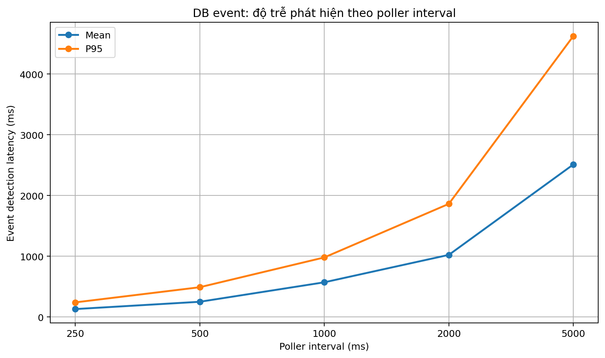
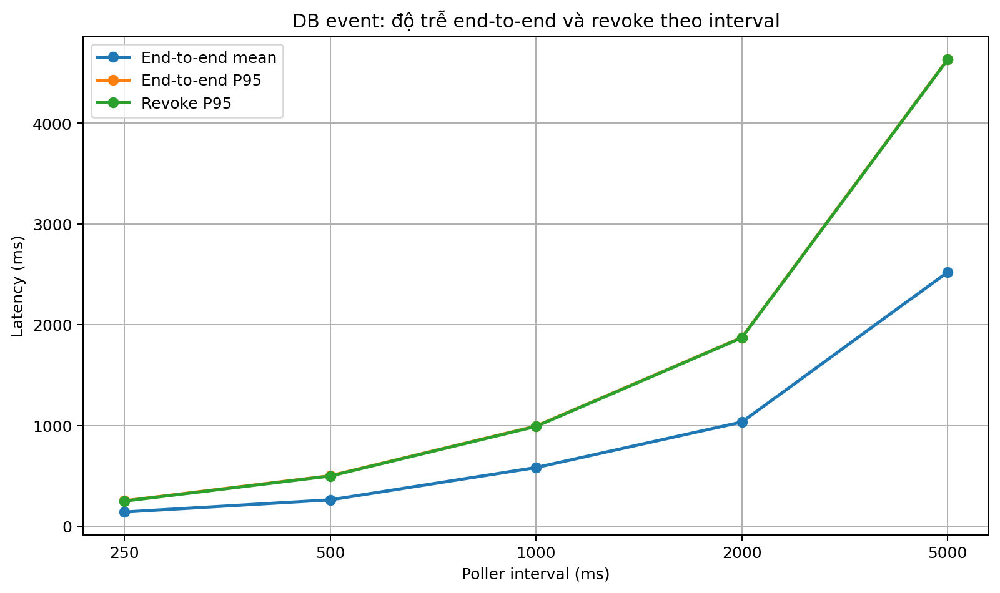
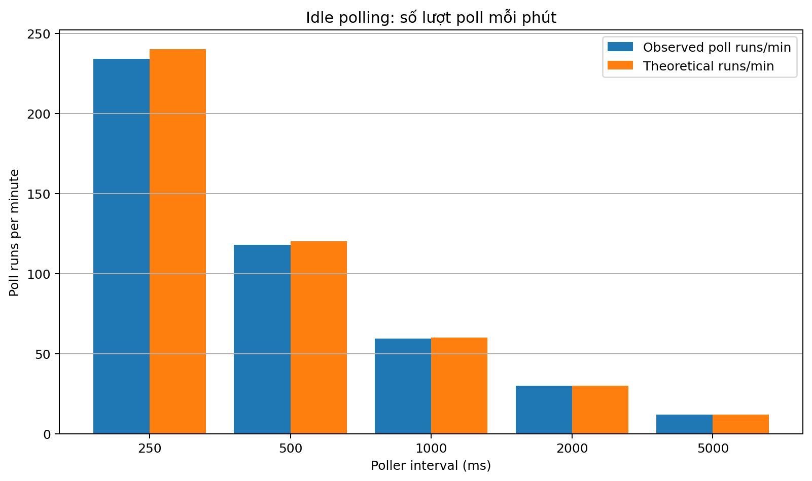
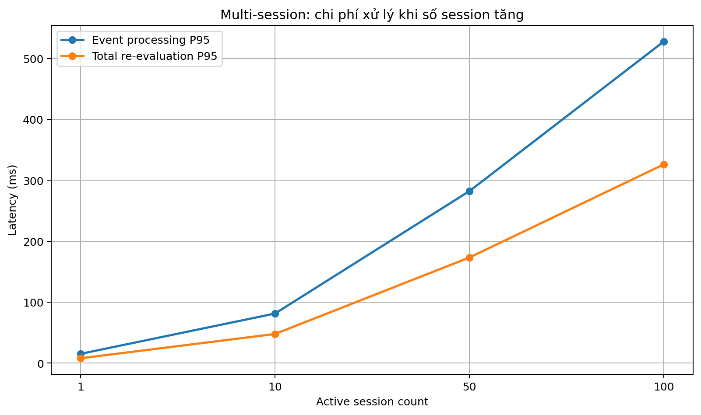
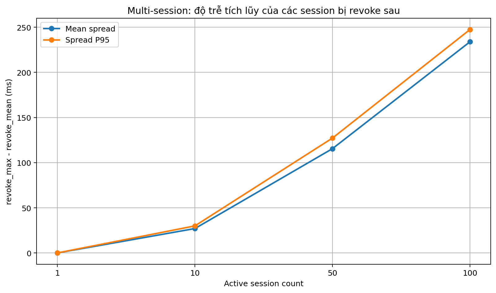
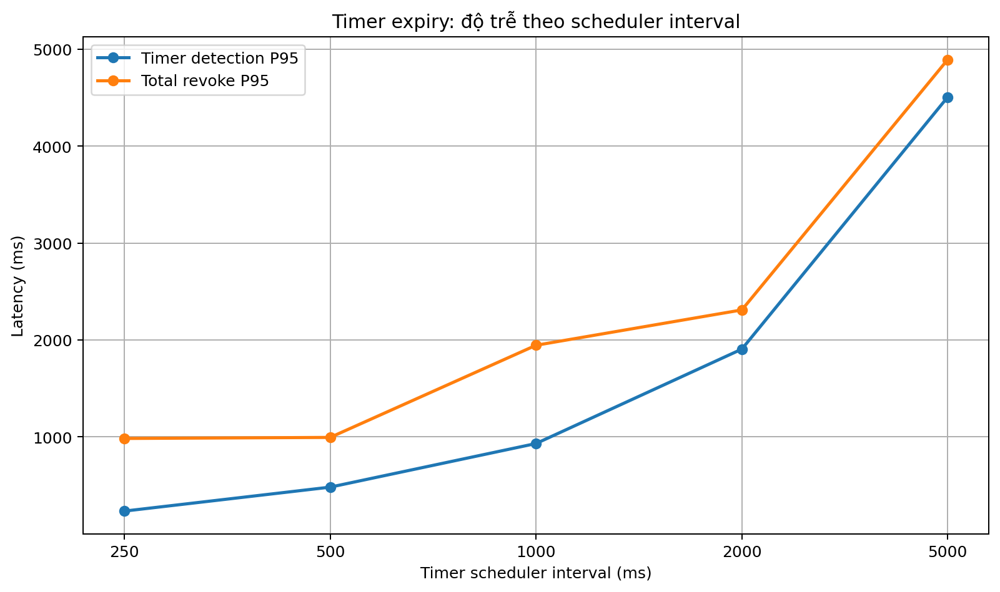
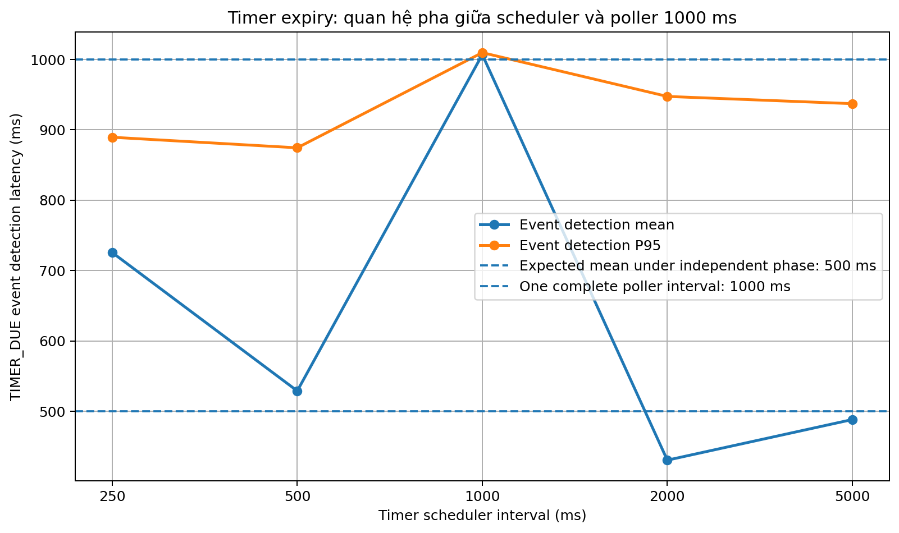
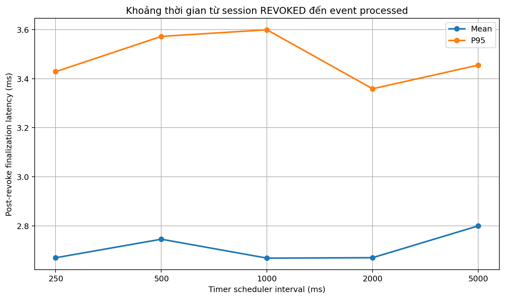

# Phân tích thống kê kết quả đo UCON Core Service

## 1. Mục đích và phạm vi

Tài liệu này phân tích các kết quả đo được thu thập theo kế hoạch **Kế hoạch đo đạc UCON Core Service**. Hai câu hỏi chính cần trả lời là:

1. Interval ngắn hơn có giúp hệ thống phát hiện vi phạm và revoke session nhanh hơn không?
2. Interval ngắn hơn làm tăng chi phí polling nền ở mức nào?

Bộ dữ liệu được phân tích gồm:

- **DB-event baseline:** 500 lượt đo, gồm 5 poller interval và 100 lượt đo cho mỗi interval.
- **Idle polling:** 5 cấu hình, mỗi cấu hình được theo dõi khoảng 300 giây.
- **DB-event multi-session:** 400 event summary và 16100 dòng chi tiết session.
- **Timer expiry:** 500 lượt đo, gồm 5 scheduler interval và 100 lượt đo cho mỗi interval; poller interval được giữ cố định ở 1000 ms.
- Mỗi cấu hình baseline, multi-session và timer được tạo từ **hai batch, mỗi batch 50 lượt đo**, sau đó được gộp thành 100 lượt để thống kê.

Kịch bản `extra_chunks_after_policy_invalidated` có trong kế hoạch nhưng **không có dữ liệu trong các file kết quả hiện tại**, vì vậy README này không tạo biểu đồ và không đưa ra kết luận cho metric đó.

## 2. Quy ước thống kê

Các bảng sử dụng các đại lượng sau:

- **Mean:** giá trị trung bình, phù hợp để mô tả chi phí trung bình.
- **P95:** 95% lượt đo không vượt quá giá trị này; đây là đại lượng chính để đánh giá độ trễ trong báo cáo.
- **Median/P50:** được dùng khi cần kiểm tra ảnh hưởng của outlier.
- **Max:** dùng để nhận diện các lần tăng đột biến, không được xem là hành vi điển hình nếu chỉ xuất hiện đơn lẻ.

P95 được tính bằng continuous percentile với nội suy tuyến tính, tương ứng với cách tính `percentile_cont` trong script đo.

## 3. Kiểm tra tính hợp lệ của dữ liệu

| Dataset | Measured rows | Successful rows | Relevant final status | Non-empty errors |
| --- | --- | --- | --- | --- |
| DB-event baseline | 500 | 500 | N/A | 0 |
| DB-event multi-session summary | 400 | 400 | 16100/16100 REVOKED | 0 |
| Timer expiry | 500 | 500 | 500/500 REVOKED | 0 |
| Idle polling | 5 | 5 | 0 events in all runs | 0 |

Kết quả kiểm tra:

- Không có lượt đo thất bại hoặc trường `error` có nội dung.
- Toàn bộ 16100 session trong dữ liệu chi tiết multi-session kết thúc ở trạng thái `REVOKED`.
- Toàn bộ 500 session timer-expiry kết thúc ở trạng thái `REVOKED`.
- Đẳng thức sau đúng trên toàn bộ dữ liệu baseline, với sai số số thực cực đại chỉ khoảng `5.453e-13` ms:

```text
event_end_to_end_latency_ms
= event_detection_latency_ms
+ event_processing_latency_ms
```

- Đẳng thức tương ứng của timer event cũng đúng, với sai số cực đại khoảng `1.243e-13` ms:

```text
timer_event_end_to_end_latency_ms
= timer_event_detection_latency_ms
+ timer_event_processing_latency_ms
```

Như vậy không có dấu hiệu ghép nhầm event, session hoặc tính sai các metric thành phần.

---

# 4. Kịch bản 1 — Một session, một DB event

## 4.1. Bảng thống kê

| Poller interval (ms) | N | Detection mean (ms) | Detection P95 (ms) | Processing mean (ms) | Processing P95 (ms) | End-to-end mean (ms) | End-to-end P95 (ms) | Re-evaluation mean (ms) | Re-evaluation P95 (ms) | Revoke P95 (ms) |
| --- | --- | --- | --- | --- | --- | --- | --- | --- | --- | --- |
| 250 | 100 | 130.1 | 240.1 | 11.5 | 13.8 | 141.6 | 253.0 | 6.2 | 7.6 | 250.2 |
| 500 | 100 | 250.2 | 489.6 | 12.0 | 14.5 | 262.2 | 501.6 | 6.5 | 7.8 | 499.1 |
| 1000 | 100 | 570.7 | 980.0 | 12.4 | 15.0 | 583.1 | 994.0 | 6.6 | 7.8 | 991.1 |
| 2000 | 100 | 1022.2 | 1861.8 | 12.1 | 14.7 | 1034.3 | 1873.8 | 6.4 | 7.5 | 1871.3 |
| 5000 | 100 | 2510.3 | 4624.0 | 12.6 | 15.2 | 2522.9 | 4635.7 | 6.6 | 8.2 | 4633.1 |

## 4.2. Độ trễ phát hiện event



Biểu đồ này giữ đúng ý tưởng trong kế hoạch: `interval → event_detection_latency_p95`.

Các kết quả chính:

- P95 detection tăng từ **240.1 ms** ở interval 250 ms lên **4624.0 ms** ở interval 5000 ms.
- Giá trị trung bình detection xấp xỉ một nửa interval trong đa số cấu hình, phù hợp với việc event có thể phát sinh tại một vị trí gần ngẫu nhiên trong chu kỳ polling.
- Interval càng ngắn thì event được phát hiện và session được revoke nhanh hơn.

Detection đôi khi lớn hơn nhẹ so với interval cấu hình, ví dụ max ở interval 5000 ms là khoảng 5008.8 ms. Đây không phải sai công thức. Kết quả idle polling cho thấy chu kỳ thực tế còn bao gồm thời gian thực hiện một lượt poll và overhead lập lịch, nên chu kỳ quan sát được có thể dài hơn interval cấu hình.

## 4.3. Độ trễ end-to-end và revoke



P95 end-to-end tăng gần tương ứng với poller interval:

- 250 ms: **253.0 ms**
- 500 ms: **501.6 ms**
- 1000 ms: **994.0 ms**
- 2000 ms: **1873.8 ms**
- 5000 ms: **4635.7 ms**

Trong khi đó, chi phí xử lý nội bộ gần như không đổi:

- Mean `event_processing_latency_ms` chỉ dao động từ **11.5 đến 12.6 ms**.
- Mean `reevaluation_duration_ms` chỉ dao động từ **6.2 đến 6.6 ms**.

Điều này cho thấy phần làm tổng độ trễ tăng khi interval dài hơn chủ yếu là **thời gian chờ poller**, không phải thời gian PDP hoặc UCON Core tái đánh giá policy.

## 4.4. Kết luận cho baseline

- Interval ngắn hơn cải thiện trực tiếp độ kịp thời của continuous authorization.
- Chi phí xử lý một event không tăng đáng kể khi thay đổi interval.
- Với yêu cầu P95 revoke gần hoặc dưới 1 giây:
  - Poller 500 ms cho biên an toàn tốt hơn, P95 revoke khoảng **499.1 ms**.
  - Poller 1000 ms đạt P95 khoảng **991.1 ms**, tức đã nằm sát ngưỡng 1 giây.

---

# 5. Idle polling — Chi phí polling nền

## 5.1. Bảng thống kê

| Poller interval (ms) | Poll runs/min | Empty polls/min | Theoretical runs/min | Actual cycle (ms) | Observed/theory (%) |
| --- | --- | --- | --- | --- | --- |
| 250 | 233.98 | 233.98 | 240.0 | 256.43 | 97.49 |
| 500 | 117.79 | 117.79 | 120.0 | 509.37 | 98.16 |
| 1000 | 59.4 | 59.4 | 60.0 | 1010.16 | 98.99 |
| 2000 | 29.8 | 29.8 | 30.0 | 2013.58 | 99.33 |
| 5000 | 12.0 | 12.0 | 12.0 | 5000.43 | 99.99 |

## 5.2. Biểu đồ



Trong tất cả các lượt idle:

```text
eventsProcessed = 0
pollRuns = emptyPolls
```

Do đó số poll mỗi phút cũng chính là số empty poll mỗi phút.

So sánh:

- 250 ms: **233.98 empty polls/min**
- 500 ms: **117.79 empty polls/min**
- 1000 ms: **59.40 empty polls/min**
- 5000 ms: **12.00 empty polls/min**

Poller 250 ms tạo:

- Khoảng **3.94 lần** số empty poll của poller 1000 ms.
- Khoảng **19.50 lần** số empty poll của poller 5000 ms.

Chu kỳ thực tế lần lượt là khoảng 256.43, 509.37, 1010.16, 2013.58 và 5000.43 ms. Điều này giải thích vì sao số poll quan sát được hơi thấp hơn giá trị lý thuyết `60000 / interval`.

## 5.3. Giới hạn của kết luận về hiệu năng

Dữ liệu hiện tại chứng minh interval ngắn làm tăng **số truy vấn polling nền**. Tuy nhiên, các file không có:

- CPU của UCON Core Service;
- CPU hoặc I/O của PostgreSQL;
- thời gian thực thi từng empty query;
- số connection hoặc thời gian giữ connection;
- memory và garbage collection.

Vì vậy chưa thể chuyển số empty poll thành phần trăm CPU hoặc chi phí tài nguyên cụ thể. Kết luận đúng trong phạm vi dữ liệu là:

> Interval ngắn làm tăng tần suất hoạt động nền và số empty poll; mức tăng tài nguyên thực tế cần thêm metric CPU, DB và I/O để định lượng.

Ngoài ra, mỗi interval idle mới chỉ có **một cửa sổ quan sát 5 phút**, nên đây là thống kê mô tả chứ chưa có phân bố để tính P95 giữa nhiều lần chạy.

---

# 6. Kịch bản 2 — Một DB event ảnh hưởng nhiều session

## 6.1. Bảng thống kê

| Active sessions | N events | Detection mean (ms) | Processing mean (ms) | Processing P95 (ms) | Re-evaluation total mean (ms) | Re-evaluation total P95 (ms) | Re-evaluation/session mean (ms) | End-to-end P95 (ms) | Revoke P95 mean (ms) | Revoke max mean (ms) | Mean max-minus-mean spread (ms) |
| --- | --- | --- | --- | --- | --- | --- | --- | --- | --- | --- | --- |
| 1 | 100 | 474.4 | 13.1 | 15.3 | 7.0 | 8.0 | 7.0 | 952.7 | 484.7 | 484.7 | 0.0 |
| 10 | 100 | 513.4 | 71.0 | 81.4 | 42.9 | 47.9 | 4.29 | 1064.6 | 580.6 | 583.0 | 27.0 |
| 50 | 100 | 486.5 | 260.6 | 282.4 | 160.1 | 173.4 | 3.2 | 1182.3 | 734.7 | 745.9 | 115.5 |
| 100 | 100 | 485.5 | 503.3 | 528.1 | 308.3 | 326.4 | 3.08 | 1438.3 | 964.4 | 987.5 | 233.9 |

## 6.2. Khả năng mở rộng theo số session



Trong kế hoạch ban đầu, biểu đồ được đề xuất là:

```text
active_session_count → reevaluation_duration_p95
```

Dữ liệu thực tế có cả thời gian tái đánh giá **trên từng session** và **tổng của toàn bộ session**. Để biểu diễn chi phí hệ thống khi fan-out tăng, biểu đồ được điều chỉnh thành:

```text
active_session_count
→ event_processing_latency_p95
→ reevaluation_total_latency_p95
```

Nếu chỉ dùng P95 của một session riêng lẻ, biểu đồ có thể gây hiểu nhầm vì thời gian trung bình trên mỗi session giảm khi số session tăng, trong khi tổng chi phí hệ thống thực tế vẫn tăng mạnh.

Mean event processing tăng:

- 1 session: **13.1 ms**
- 10 sessions: **71.0 ms**
- 50 sessions: **260.6 ms**
- 100 sessions: **503.3 ms**

Hồi quy tuyến tính trên bốn điểm trung bình cho kết quả gần đúng:

```text
event_processing_latency_ms
≈ 15.02 + 4.89 × session_count
R² = 0.9993
```

Tổng thời gian tái đánh giá cũng gần tuyến tính:

```text
reevaluation_total_ms
≈ 8.53 + 3.01 × session_count
R² = 0.9992
```

Do chỉ có bốn mức session count, các phương trình trên nên được xem là mô tả xu hướng trong phạm vi 1–100 session, không phải mô hình dự báo cho quy mô lớn hơn.

## 6.3. Hiện tượng xử lý tuần tự và độ trễ session cuối



Biểu đồ sử dụng:

```text
revoke_spread_ms = revoke_max_ms - revoke_mean_ms
```

Metric này loại bớt phần chờ poller chung cho toàn bộ session và làm rõ độ trễ tích lũy trong quá trình xử lý nhiều session.

Mean spread tăng từ:

- 1 session: **0.0 ms**
- 10 sessions: khoảng **27.0 ms**
- 50 sessions: khoảng **115.5 ms**
- 100 sessions: khoảng **233.9 ms**

Kết quả này cho thấy các session nhiều khả năng được tái đánh giá và cập nhật trạng thái chủ yếu theo thứ tự tuần tự. Session nằm về cuối danh sách phải chờ các session trước hoàn tất nên có revoke latency cao hơn.

Điều này không phải lỗi dữ liệu, nhưng là giới hạn mở rộng quan trọng:

> Khi một thay đổi thuộc tính ảnh hưởng đến nhiều usage session, thời gian xử lý event và độ trễ của các session bị revoke sau tăng gần tuyến tính theo số session bị ảnh hưởng.

## 6.4. Vì sao thời gian trung bình trên mỗi session lại giảm?

Mean `reevaluation_mean_ms` giảm từ khoảng 7.00 ms ở 1 session xuống khoảng 3.08 ms ở 100 session. Không nên diễn giải rằng policy evaluation tự nhiên nhanh hơn khi có nhiều session.

Các nguyên nhân có thể gồm:

- chi phí cố định của một event được phân bổ cho nhiều session;
- cache dữ liệu hoặc cache policy được tái sử dụng;
- JIT/JVM đã được làm nóng trong vòng lặp;
- các session dùng cùng policy và cùng nguồn thuộc tính.

Dữ liệu hiện tại không tách được các thành phần này. Đại lượng phù hợp để đánh giá khả năng mở rộng vẫn là `reevaluation_total_ms` và `event_processing_latency_ms`.

---

# 7. Kịch bản 3 — Rental hết hạn theo timer

## 7.1. Bảng thống kê

| Scheduler interval (ms) | N | Timer detection mean (ms) | Timer detection P95 (ms) | Event detection mean (ms) | Event detection P95 (ms) | Event processing mean (ms) | Event processing P95 (ms) | Total revoke mean (ms) | Total revoke P95 (ms) | Post-revoke finalization mean (ms) | Post-revoke finalization P95 (ms) |
| --- | --- | --- | --- | --- | --- | --- | --- | --- | --- | --- | --- |
| 250 | 100 | 140.0 | 234.7 | 725.6 | 889.5 | 12.5 | 15.3 | 875.4 | 984.1 | 2.67 | 3.43 |
| 500 | 100 | 243.3 | 481.9 | 528.9 | 874.5 | 12.8 | 15.7 | 782.3 | 994.8 | 2.75 | 3.57 |
| 1000 | 100 | 539.6 | 931.8 | 1006.9 | 1009.7 | 12.3 | 15.2 | 1556.1 | 1945.4 | 2.67 | 3.6 |
| 2000 | 100 | 943.4 | 1905.9 | 430.5 | 947.5 | 12.5 | 15.3 | 1383.7 | 2310.1 | 2.67 | 3.36 |
| 5000 | 100 | 2571.7 | 4506.0 | 488.2 | 937.2 | 13.1 | 15.6 | 3070.2 | 4892.5 | 2.8 | 3.46 |

## 7.2. Độ trễ timer và tổng revoke



Timer-based đi qua hai lớp chờ:

```text
dependency_due_at
→ scheduler tạo TIMER_DUE event
→ trigger-event poller lấy event
→ UCON Core xử lý và revoke session
```

Vì vậy:

```text
timer_total_revoke_latency_ms
```

chịu ảnh hưởng của cả scheduler interval và poller interval.

`timer_detection_latency_ms` tăng theo scheduler interval như kỳ vọng. Tuy nhiên tổng revoke không tăng hoàn toàn đơn điệu:

- Scheduler 250 ms có mean total revoke khoảng **875.4 ms**.
- Scheduler 500 ms có mean total revoke khoảng **782.3 ms**.
- Scheduler 1000 ms có mean total revoke khoảng **1556.1 ms**.
- Scheduler 2000 ms có mean total revoke khoảng **1383.7 ms**.
- Scheduler 5000 ms có mean total revoke khoảng **3070.2 ms**.

Không nên kết luận từ các con số trên rằng scheduler 500 ms luôn tốt hơn 250 ms, hoặc 2000 ms luôn tốt hơn 1000 ms. Nguyên nhân nằm ở quan hệ pha giữa hai tác vụ định kỳ.

## 7.3. Bất thường quan trọng: đồng bộ pha scheduler–poller



Poller interval trong toàn bộ timer-expiry là 1000 ms. Nếu thời điểm scheduler tạo event độc lập và phân bố đều so với chu kỳ poller, mean event detection kỳ vọng sẽ gần:

```text
1000 / 2 = 500 ms
```

Kết quả quan sát:

- Scheduler 500 ms: mean khoảng **528.9 ms**.
- Scheduler 2000 ms: mean khoảng **430.5 ms**.
- Scheduler 5000 ms: mean khoảng **488.2 ms**.
- Scheduler 250 ms: mean cao bất thường, khoảng **725.6 ms**.
- Scheduler 1000 ms: mean **1006.9 ms**, P95 **1009.7 ms**, gần như phải chờ trọn một chu kỳ poller.

Trường hợp scheduler 1000 ms phù hợp với thứ tự lặp ổn định sau:

```text
Poller vừa kiểm tra và không thấy event
→ Scheduler tạo TIMER_DUE ngay sau lượt poll
→ Event chờ đến lượt poll tiếp theo
→ timer_event_detection_latency gần 1000 ms
```

`random_phase_ms` trong script làm ngẫu nhiên thời điểm rental hết hạn so với scheduler tick, nhưng không đảm bảo pha giữa **scheduler tick tạo event** và **trigger poller tick lấy event** được ngẫu nhiên hóa.

Đây là một hiệu ứng thực của hai tác vụ polling định kỳ, nhưng cũng là yếu tố gây nhiễu khi mục tiêu là so sánh riêng scheduler interval.

### Cách đọc kết quả timer hiện tại

- Dùng `timer_detection_latency_ms` để đánh giá riêng khả năng scheduler phát hiện điều kiện đến hạn.
- Dùng `timer_event_detection_latency_ms` để quan sát ảnh hưởng của poller và quan hệ pha.
- Dùng `timer_total_revoke_latency_ms` để đánh giá trải nghiệm end-to-end thực tế của cấu hình hiện tại.
- Không dùng duy nhất total latency để xếp hạng scheduler interval nếu chưa kiểm soát phase alignment.

### Cách cải thiện thí nghiệm sau này

- Lặp lại mỗi cấu hình qua nhiều lần restart Backend để thay đổi pha khởi tạo của scheduler và poller.
- Ghi timestamp của từng scheduler tick và poller tick.
- Thử nhiều poller interval thay vì cố định 1000 ms.
- Ngẫu nhiên hóa offset khởi động của một trong hai tác vụ.
- Tránh chỉ dùng các cặp interval bằng nhau hoặc có quan hệ bội số khi muốn đo tác động độc lập.

## 7.4. Vì sao total revoke lệch khoảng 2–3 ms so với tổng hai metric?

Các mốc:

```text
D = dependency_due_at
O = event_occurred_at
R = session_revoked_at
F = event_processed_at
```

Theo định nghĩa:

```text
timer_detection_latency_ms = O - D
timer_event_end_to_end_latency_ms = F - O
timer_total_revoke_latency_ms = R - D
```

Do đó:

```text
timer_detection_latency_ms
+ timer_event_end_to_end_latency_ms
- timer_total_revoke_latency_ms

= (O - D) + (F - O) - (R - D)
= F - R
= event_processed_at - session_revoked_at
```

Khoảng lệch chính là thời gian từ lúc session đã được chuyển sang `REVOKED` đến lúc event được đánh dấu xử lý xong.

Trên toàn bộ 500 lượt timer:

- Mean: **2.711 ms**
- Median: **2.667 ms**
- P95: **3.467 ms**
- Min: **1.456 ms**
- Max: **8.055 ms**



Đây không phải sai số làm tròn. Các metric sử dụng hai mốc kết thúc khác nhau:

- `timer_total_revoke_latency_ms` dừng tại `session_revoked_at`.
- Tổng detection và event end-to-end dừng tại `event_processed_at`.

Tên metric có thể bổ sung để làm rõ:

```text
post_revoke_finalization_latency_ms
= event_processed_at - session_revoked_at
```

---

# 8. Các outlier và điểm cần lưu ý

| Scenario/configuration | Observed value | Interpretation |
| --- | --- | --- |
| Baseline, poller 500 ms | processing 23.394 ms; re-evaluation 16.632 ms | A rare transient spike; both maxima occur in the same iteration. |
| Multi-session, 1 session | processing 61.303 ms; re-evaluation total 33.675 ms | Large single-event spike, but P95 processing remains 15.279 ms. |
| Multi-session, 10 sessions | processing 121.966 ms; re-evaluation total 76.922 ms | Rare spike; P95 processing remains 81.431 ms. |
| Multi-session, 100 sessions | one session re-evaluation max 52.456 ms | A per-session outlier; aggregate P95 remains stable. |
| Timer, scheduler 5000 ms | re-evaluation max 15.667 ms | Processing outlier; timer waiting still dominates total latency. |
| Timer, scheduler 250 ms | post-revoke finalization max 8.055 ms | Largest finalization gap, but overall P95 is only 3.467 ms. |

Các outlier trên xuất hiện đơn lẻ và không làm P95 tăng tương ứng, nên chưa có dấu hiệu suy giảm có hệ thống.

Không nên tự động xóa các dòng này. Những nguyên nhân khả dĩ gồm JVM/JIT, garbage collection, PostgreSQL flush/checkpoint, CPU scheduling của hệ điều hành hoặc tải nền khác. Tuy nhiên, dữ liệu hiện tại không chứa GC log, system metrics hoặc PostgreSQL timing nên chưa thể xác định nguyên nhân cụ thể.

Trong báo cáo nên:

- giữ nguyên outlier;
- trình bày mean, P95 và max;
- mô tả max là đỉnh quan sát được, không xem nó là hành vi điển hình;
- chỉ loại dữ liệu khi có bằng chứng lỗi thí nghiệm hoặc lỗi hệ thống.

---

# 9. Trả lời hai câu hỏi nghiên cứu

## 9.1. Interval ngắn hơn có giúp revoke nhanh hơn không?

**Có, rõ ràng đối với DB event-driven.**

P95 revoke giảm từ khoảng **4633.1 ms** ở poller 5000 ms xuống **250.2 ms** ở poller 250 ms.

Chi phí xử lý event và tái đánh giá policy gần như ổn định giữa các interval, nên phần cải thiện chủ yếu đến từ việc giảm thời gian chờ phát hiện event.

Đối với timer-based, scheduler interval ngắn hơn làm giảm riêng `timer_detection_latency_ms`, nhưng total revoke còn phụ thuộc vào poller interval và phase alignment.

## 9.2. Interval ngắn hơn có làm tăng chi phí polling nền không?

**Có về số lượt hoạt động nền.**

Số empty poll tăng từ khoảng **12.00/min** ở interval 5000 ms lên **233.98/min** ở interval 250 ms.

Tuy nhiên chưa thể phát biểu mức tăng CPU hoặc I/O vì chưa đo các tài nguyên đó.

---

# 10. Đánh giá lựa chọn interval

Dựa trên latency baseline:

- **250 ms:** revoke nhanh nhất nhưng gần 234 empty poll/min.
- **500 ms:** P95 revoke khoảng 499 ms, khoảng 118 empty poll/min.
- **1000 ms:** P95 revoke khoảng 991 ms, khoảng 59 empty poll/min.
- **2000–5000 ms:** giảm chi phí polling nhưng P95 revoke từ khoảng 1.87 đến 4.63 giây.

Nếu yêu cầu nghiệp vụ là revoke trong khoảng 1 giây ở P95:

- 500 ms là lựa chọn an toàn hơn.
- 1000 ms có thể chấp nhận nhưng nằm sát ngưỡng và dễ vượt khi tải hệ thống tăng.

Dù vậy, chưa nên chốt cấu hình cuối cùng chỉ từ bộ dữ liệu hiện tại. Cần bổ sung CPU/DB metrics và kịch bản đọc thêm chunk để đánh giá trade-off đầy đủ.

---

# 11. Giới hạn của phép đo

1. Không có dữ liệu cho `extra_chunks_after_policy_invalidated`.
2. Idle polling chỉ có một lần đo 5 phút cho mỗi interval.
3. Không có CPU, memory, DB I/O, query duration hoặc GC metrics.
4. Timer-expiry chỉ thay scheduler interval; poller luôn cố định ở 1000 ms.
5. Scheduler và poller có thể bị phase alignment.
6. Multi-session đo một event ảnh hưởng nhiều session, chưa đo nhiều event đồng thời hoặc hàng đợi backlog.
7. Kết quả chỉ đại diện cho môi trường phần cứng, Docker, JVM và PostgreSQL tại thời điểm đo.
8. Hồi quy multi-session chỉ dựa trên bốn mức 1, 10, 50 và 100 session.

---

# 12. Danh sách biểu đồ

| File | Nội dung | Quan hệ với kế hoạch |
|---|---|---|
| `charts/01_db_event_detection_latency.png` | Interval → detection mean/P95 | Giữ nguyên biểu đồ đề xuất |
| `charts/02_db_event_end_to_end_latency.png` | Interval → end-to-end và revoke P95 | Giữ nguyên và bổ sung revoke |
| `charts/03_idle_polling_overhead.png` | Interval → poll runs/min | Tương đương empty polls/min vì toàn bộ poll là empty |
| `charts/04_multi_session_scaling.png` | Session count → processing và tổng re-evaluation P95 | Điều chỉnh để phản ánh tổng chi phí hệ thống |
| `charts/05_multi_session_revoke_spread.png` | Session count → độ trễ tích lũy của session cuối | Biểu đồ bổ sung |
| `charts/06_timer_latency_by_scheduler.png` | Scheduler interval → timer detection và total revoke P95 | Biểu đồ bổ sung cho kịch bản timer |
| `charts/07_timer_phase_alignment.png` | Scheduler interval → TIMER_DUE event detection | Phân tích bất thường phase alignment |
| `charts/08_post_revoke_finalization.png` | Scheduler interval → finalization mean/P95 | Giải thích sai lệch 2–3 ms |

Biểu đồ `interval → extra_chunks_after_policy_invalidated` không được tạo vì bộ dữ liệu hiện tại chưa có metric này.
