# Phân tích thống kê kết quả đo UCON Core Service sau khi bật postUpdate

## 1. Phạm vi phân tích

Tài liệu này phân tích lại toàn bộ số liệu sau khi mã nguồn được cập nhật để thực thi `postUpdate` khi:

- ongoing access bị revoke;
- người dùng chủ động kết thúc usage session.

Bộ dữ liệu hiện tại gồm:

- **DB-event baseline:** 500 lượt đo.
- **Idle polling:** 5 cấu hình, mỗi cấu hình khoảng 300 giây.
- **DB-event multi-session:** 400 event summary và 16100 dòng chi tiết session.
- **Timer expiry:** 500 lượt đo.
- Mỗi cấu hình baseline, multi-session và timer gồm hai batch 50 lượt, được gộp thành 100 lượt để thống kê.

Để đánh giá ảnh hưởng của `postUpdate`, tài liệu cũng đối chiếu với bộ số liệu trước khi chức năng này được bật.

> **Giới hạn quan trọng:** các kịch bản hiện tại đều đo đường revoke. Không có kịch bản riêng cho `user end session`, vì vậy số liệu chỉ định lượng trực tiếp chi phí `postUpdate` trong đường revoke. Không nên suy rộng chính xác các con số này sang đường user end mà chưa đo bổ sung.

## 2. Quy ước thống kê

- **Mean:** giá trị trung bình.
- **P95:** 95% lượt đo không vượt quá giá trị này.
- **Max:** dùng để phát hiện đỉnh bất thường.
- P95 được tính bằng continuous percentile với nội suy tuyến tính.

## 3. Kiểm tra tính hợp lệ của dữ liệu

| Dataset | Measured rows | Successful rows | Final status | Non-empty errors |
| --- | --- | --- | --- | --- |
| DB-event baseline | 500 | 500 | N/A | 0 |
| DB-event multi-session summary | 400 | 400 | 16100/16100 REVOKED | 0 |
| Timer expiry | 500 | 500 | 500/500 REVOKED | 0 |
| Idle polling | 5 | 5 | 0 events in all runs | 0 |

Kết quả kiểm tra:

- Không có lượt đo thất bại hoặc trường `error` có nội dung.
- Toàn bộ 16100 session trong multi-session và 500 session timer đều kết thúc ở trạng thái `REVOKED`.
- Đẳng thức baseline đúng trên toàn bộ dữ liệu, sai số số thực cực đại chỉ `6.324e-13` ms:

```text
event_end_to_end_latency_ms
= event_detection_latency_ms
+ event_processing_latency_ms
```

- Đẳng thức timer event cũng đúng, sai số cực đại `1.599e-13` ms:

```text
timer_event_end_to_end_latency_ms
= timer_event_detection_latency_ms
+ timer_event_processing_latency_ms
```

Không có dấu hiệu tính sai metric, ghép nhầm event hoặc ghép nhầm session.

---

# 4. Kịch bản 1 — Một session, một DB event

## 4.1. Bảng thống kê

| Poller interval (ms) | N | Detection mean (ms) | Detection P95 (ms) | Processing mean (ms) | Processing P95 (ms) | End-to-end mean (ms) | End-to-end P95 (ms) | Re-evaluation mean (ms) | Re-evaluation P95 (ms) | Revoke mean (ms) | Revoke P95 (ms) | Post-revoke finalization mean (ms) | Post-revoke finalization P95 (ms) |
| --- | --- | --- | --- | --- | --- | --- | --- | --- | --- | --- | --- | --- | --- |
| 250 | 100 | 128.0 | 240.4 | 17.7 | 20.4 | 145.7 | 257.4 | 6.39 | 7.91 | 137.5 | 249.5 | 8.22 | 9.57 |
| 500 | 100 | 264.8 | 487.9 | 17.5 | 20.5 | 282.3 | 505.7 | 6.43 | 7.61 | 274.2 | 497.2 | 8.05 | 9.7 |
| 1000 | 100 | 470.3 | 975.1 | 17.4 | 20.5 | 487.8 | 993.1 | 6.3 | 7.59 | 479.5 | 984.5 | 8.26 | 9.87 |
| 2000 | 100 | 1021.8 | 1967.3 | 17.9 | 20.2 | 1039.7 | 1984.2 | 6.39 | 7.71 | 1031.3 | 1976.3 | 8.45 | 10.06 |
| 5000 | 100 | 2695.4 | 4745.8 | 17.3 | 20.2 | 2712.7 | 4763.4 | 6.07 | 7.52 | 2704.3 | 4754.9 | 8.32 | 10.46 |

## 4.2. Độ trễ phát hiện và revoke

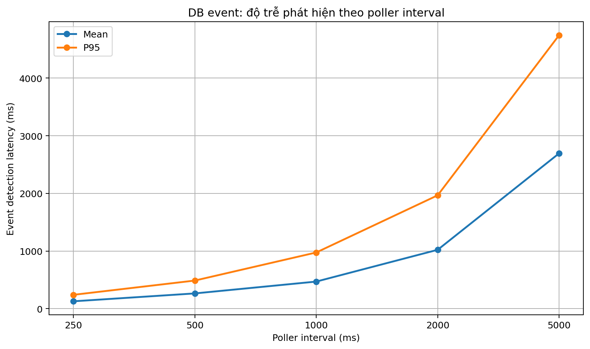

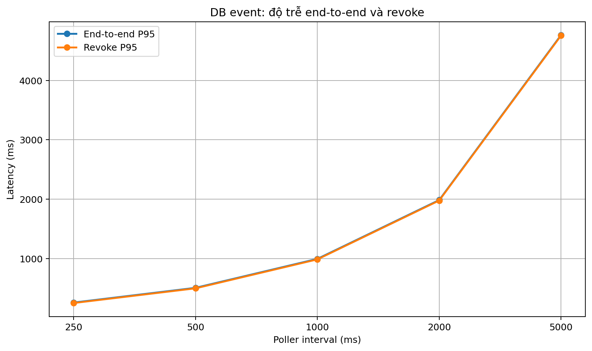

Xu hướng chính không thay đổi:

- P95 detection tăng từ **240.4 ms** ở interval 250 ms lên **4745.8 ms** ở interval 5000 ms.
- P95 revoke lần lượt là:
  - 250 ms: **249.5 ms**
  - 500 ms: **497.2 ms**
  - 1000 ms: **984.5 ms**
  - 2000 ms: **1976.3 ms**
  - 5000 ms: **4754.9 ms**

Mean event processing chỉ dao động từ **17.3 đến 17.9 ms**, còn mean re-evaluation từ **6.07 đến 6.43 ms**. Vì vậy poller interval vẫn chủ yếu ảnh hưởng thời gian chờ phát hiện event, không ảnh hưởng thời gian PDP tái đánh giá.

## 4.3. Ảnh hưởng của postUpdate

| Poller interval (ms) | Processing mean before (ms) | Processing mean after (ms) | Processing change (%) | Re-evaluation mean before (ms) | Re-evaluation mean after (ms) | Finalization mean before (ms) | Finalization mean after (ms) |
| --- | --- | --- | --- | --- | --- | --- | --- |
| 250 | 11.5 | 17.7 | 53.9 | 6.2 | 6.39 | 2.44 | 8.22 |
| 500 | 12.0 | 17.5 | 45.8 | 6.45 | 6.43 | 2.58 | 8.05 |
| 1000 | 12.4 | 17.4 | 40.3 | 6.56 | 6.3 | 2.77 | 8.26 |
| 2000 | 12.1 | 17.9 | 47.9 | 6.44 | 6.39 | 2.6 | 8.45 |
| 5000 | 12.6 | 17.3 | 37.3 | 6.65 | 6.07 | 2.8 | 8.32 |

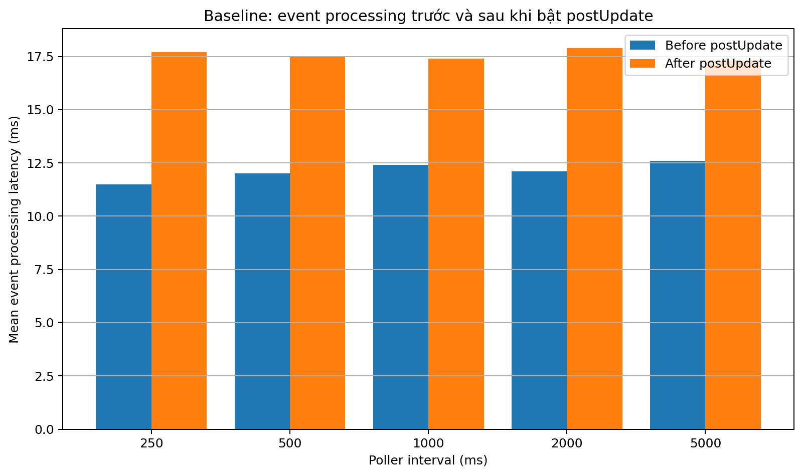

Sau khi bật `postUpdate`:

- Mean event processing tăng từ khoảng **11.5–12.6 ms** lên **17.3–17.9 ms**.
- Mức tăng tương đối nằm khoảng **37–54%**, tương ứng tăng tuyệt đối khoảng 5–6 ms/event.
- Mean re-evaluation gần như không đổi, vẫn quanh 6–6.5 ms.

Điều này cho thấy phần tăng thêm nằm **sau hoặc ngoài khối tái đánh giá policy**, phù hợp với việc hệ thống thực hiện thêm update và các thao tác hoàn tất sau quyết định revoke.

---

# 5. Idle polling và poller interval đại diện

## 5.1. Bảng idle polling

| Poller interval (ms) | Poll runs/min | Empty polls/min | Theoretical runs/min | Actual cycle (ms) | Observed/theory (%) |
| --- | --- | --- | --- | --- | --- |
| 250 | 233.59 | 233.59 | 240.0 | 256.86 | 97.33 |
| 500 | 117.59 | 117.59 | 120.0 | 510.24 | 97.99 |
| 1000 | 59.4 | 59.4 | 60.0 | 1010.16 | 98.99 |
| 2000 | 29.8 | 29.8 | 30.0 | 2013.56 | 99.33 |
| 5000 | 12.0 | 12.0 | 12.0 | 5000.35 | 99.99 |

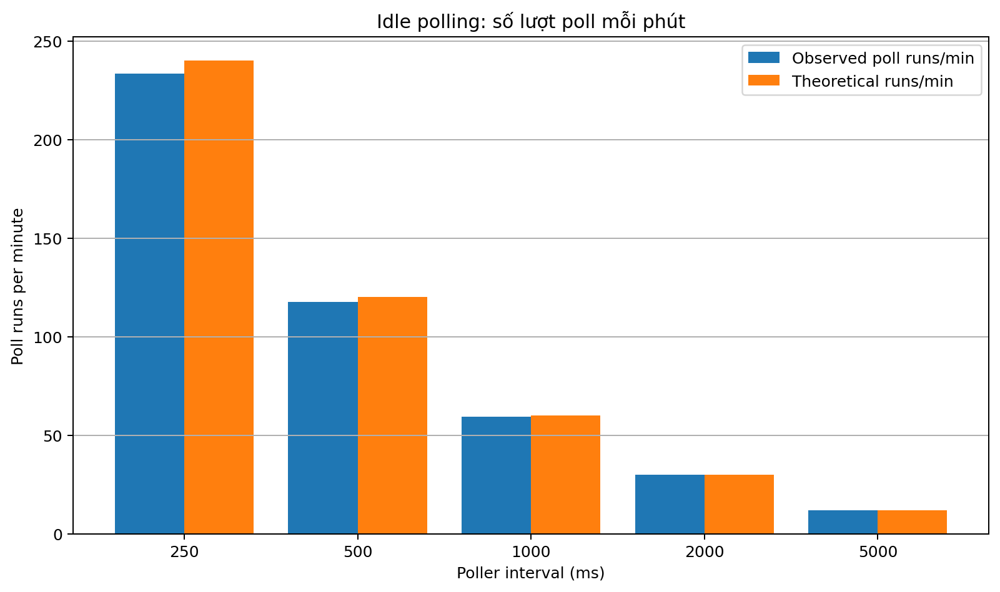

Toàn bộ lượt poll trong phép đo idle đều là empty poll:

```text
eventsProcessed = 0
pollRuns = emptyPolls
```

Số empty poll mỗi phút:

- 250 ms: **233.59**
- 500 ms: **117.59**
- 1000 ms: **59.40**
- 2000 ms: **29.80**
- 5000 ms: **12.00**

## 5.2. Điểm cân bằng

| Poller interval (ms) | Detection P95 (ms) | Revoke P95 (ms) | Empty polls/min | Normalized revoke P95 | Normalized empty polls | Absolute normalized gap | Equal-weight balance score |
| --- | --- | --- | --- | --- | --- | --- | --- |
| 250 | 240.4 | 249.5 | 233.59 | 0.0525 | 1.0 | 0.9475 | 1.0525 |
| 500 | 487.9 | 497.2 | 117.59 | 0.1046 | 0.5034 | 0.3988 | 0.608 |
| 1000 | 975.1 | 984.5 | 59.4 | 0.207 | 0.2543 | 0.0472 | 0.4613 |
| 2000 | 1967.3 | 1976.3 | 29.8 | 0.4156 | 0.1276 | 0.2881 | 0.5432 |
| 5000 | 4745.8 | 4754.9 | 12.0 | 1.0 | 0.0514 | 0.9486 | 1.0514 |

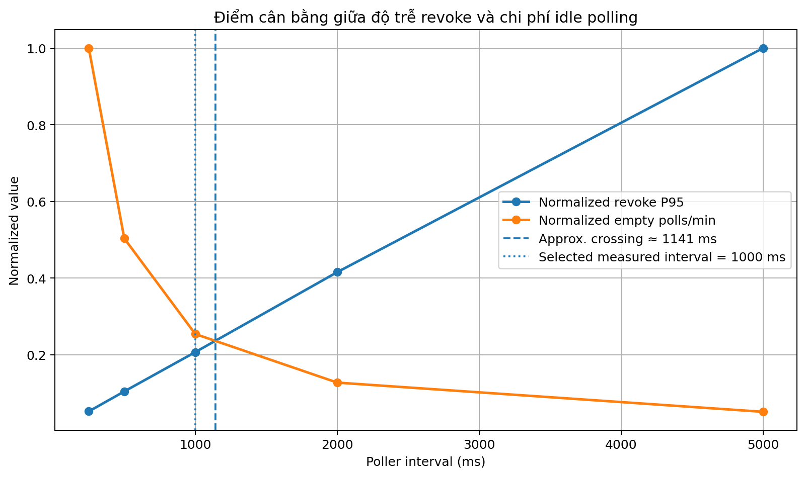

Khi chuẩn hóa `revoke_latency_p95` và `empty_polls_per_minute` về 0–1 với trọng số bằng nhau:

- giao điểm nội suy xấp xỉ **1140.9 ms**;
- trong các mốc đã đo, **1000 ms** có balance score thấp nhất và gần điểm giao nhất.

Vì vậy poller interval đại diện cho kịch bản 2 và 3 **vẫn là 1000 ms**.

Lập luận thực tế:

- chuyển 1000 → 500 ms gần như giảm một nửa P95 revoke, nhưng số empty poll gần gấp đôi;
- chuyển 1000 → 2000 ms giảm một nửa số empty poll, nhưng P95 revoke gần gấp đôi.

> Biểu đồ điểm giao là công cụ hỗ trợ quyết định, không phải một định luật khách quan. Kết quả phụ thuộc vào cách chuẩn hóa và giả định hai tiêu chí có trọng số bằng nhau. Nếu hệ thống có SLA revoke nghiêm ngặt hơn chi phí nền, có thể ưu tiên 500 ms.

---

# 6. Kịch bản 2 — Một event ảnh hưởng nhiều session

## 6.1. Bảng thống kê

| Active sessions | N events | Detection mean (ms) | Processing mean (ms) | Processing P95 (ms) | Processing max (ms) | Re-evaluation total mean (ms) | Re-evaluation total P95 (ms) | Re-evaluation/session mean (ms) | Non-reevaluation overhead mean (ms) | End-to-end P95 (ms) | Revoke P95 mean (ms) | Revoke max mean (ms) | Mean max-minus-mean spread (ms) | Spread P95 (ms) |
| --- | --- | --- | --- | --- | --- | --- | --- | --- | --- | --- | --- | --- | --- | --- |
| 1 | 100 | 515.5 | 18.3 | 21.2 | 24.4 | 6.6 | 7.8 | 6.617 | 11.7 | 923.2 | 525.3 | 525.3 | 0.0 | 0.0 |
| 10 | 100 | 466.7 | 107.7 | 118.7 | 123.9 | 41.2 | 46.1 | 4.122 | 66.5 | 1071.0 | 566.0 | 569.9 | 42.6 | 47.2 |
| 50 | 100 | 545.8 | 414.1 | 436.2 | 452.7 | 158.3 | 168.2 | 3.167 | 255.7 | 1349.6 | 937.2 | 955.8 | 188.0 | 202.2 |
| 100 | 100 | 491.0 | 789.5 | 834.3 | 1010.3 | 300.1 | 323.4 | 3.001 | 489.4 | 1761.1 | 1239.3 | 1276.5 | 374.3 | 393.7 |

## 6.2. Khả năng mở rộng

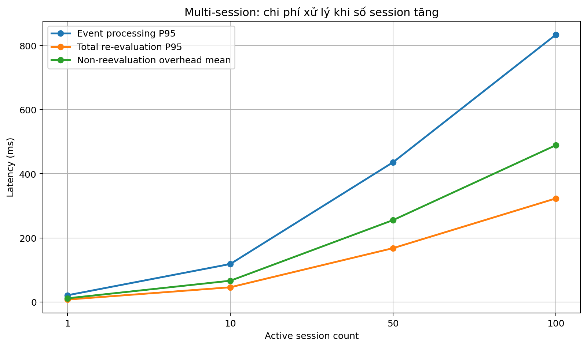

Mean event processing tăng:

- 1 session: **18.3 ms**
- 10 sessions: **107.7 ms**
- 50 sessions: **414.1 ms**
- 100 sessions: **789.5 ms**

Hồi quy tuyến tính trên bốn mức session:

```text
Sau postUpdate:
event_processing_latency_ms
≈ 21.81
+ 7.72 × session_count
R² = 0.9993

Trước postUpdate:
event_processing_latency_ms
≈ 15.02
+ 4.89 × session_count
R² = 0.9993
```

Độ dốc processing tăng từ khoảng **4.89 ms/session** lên **7.72 ms/session**.

Trong khi đó, độ dốc tổng re-evaluation gần như không đổi:

```text
Trước: 3.01 ms/session
Sau:   2.94 ms/session
```

Đây là bằng chứng mạnh cho thấy chi phí tăng thêm không đến từ PDP evaluation mà đến từ phần xử lý sau quyết định, trong đó có `postUpdate`.

## 6.3. So sánh trước và sau postUpdate

| Active sessions | Processing mean before (ms) | Processing mean after (ms) | Processing change (%) | Re-evaluation total before (ms) | Re-evaluation total after (ms) | Revoke spread before (ms) | Revoke spread after (ms) |
| --- | --- | --- | --- | --- | --- | --- | --- |
| 1 | 13.1 | 18.3 | 39.7 | 7.0 | 6.6 | 0.0 | 0.0 |
| 10 | 71.0 | 107.7 | 51.7 | 42.9 | 41.2 | 27.0 | 42.6 |
| 50 | 260.6 | 414.1 | 58.9 | 160.1 | 158.3 | 115.5 | 188.0 |
| 100 | 503.3 | 789.5 | 56.9 | 308.3 | 300.1 | 233.9 | 374.3 |

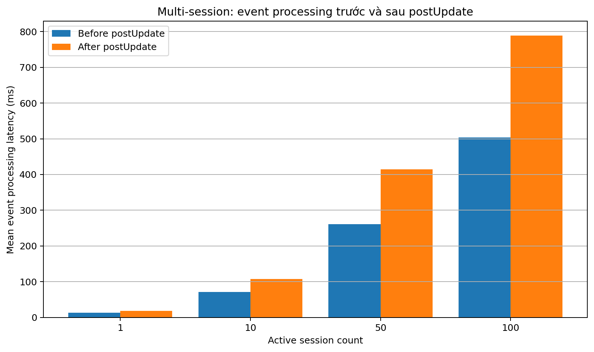

Mean processing tăng:

- 1 session: khoảng **40%**
- 10 sessions: khoảng **52%**
- 50 sessions: khoảng **59%**
- 100 sessions: khoảng **57%**

Tổng re-evaluation lại giảm nhẹ 1–5%, nằm trong biến động giữa các lần chạy. Như vậy `postUpdate` làm tăng phần **non-reevaluation overhead** theo từng session.

Với 100 session:

- Processing P95: **834.3 ms**
- Processing max: **1010.3 ms**
- Có **1** lượt processing vượt poller interval 1000 ms.

Một lượt vượt 1000 ms chưa chứng minh có backlog, nhưng cho thấy ở tải 100 session, event processing đã tiến sát chu kỳ poller. Nếu các event lớn đến liên tục, poll tiếp theo có thể bị trễ hoặc hàng đợi event có thể tích tụ, tùy cách scheduler được cấu hình.

## 6.4. Độ trễ tích lũy giữa các session

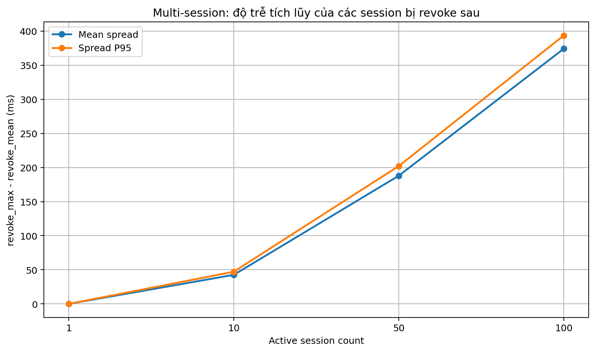

Mean `revoke_max - revoke_mean` tăng:

- 10 sessions: từ khoảng 27.0 lên **42.6 ms**
- 50 sessions: từ khoảng 115.5 lên **188.0 ms**
- 100 sessions: từ khoảng 233.9 lên **374.3 ms**

Đây là mức tăng khoảng 58–63%.

Kết quả này phù hợp với giả thuyết hệ thống đang xử lý session chủ yếu tuần tự và thực hiện thêm `postUpdate` trong mỗi vòng session. Đây là **suy luận từ số liệu**, không phải phép đo trực tiếp thứ tự gọi hàm.

---

# 7. Kịch bản 3 — Rental hết hạn theo timer

## 7.1. Bảng thống kê

| Scheduler interval (ms) | N | Timer detection mean (ms) | Timer detection P95 (ms) | Event detection mean (ms) | Event detection P95 (ms) | Event processing mean (ms) | Event processing P95 (ms) | Total revoke mean (ms) | Total revoke P95 (ms) | Re-evaluation mean (ms) | Re-evaluation P95 (ms) | Post-revoke finalization mean (ms) | Post-revoke finalization P95 (ms) |
| --- | --- | --- | --- | --- | --- | --- | --- | --- | --- | --- | --- | --- | --- |
| 250 | 100 | 137.2 | 248.8 | 746.7 | 909.2 | 18.4 | 21.1 | 893.9 | 994.4 | 6.69 | 7.92 | 8.43 | 10.04 |
| 500 | 100 | 282.6 | 486.2 | 457.5 | 832.8 | 18.6 | 21.1 | 750.1 | 992.0 | 6.74 | 7.92 | 8.53 | 10.13 |
| 1000 | 100 | 452.5 | 946.0 | 1009.4 | 1014.1 | 18.2 | 21.2 | 1471.3 | 1967.2 | 6.5 | 7.68 | 8.69 | 10.47 |
| 2000 | 100 | 1030.7 | 1963.6 | 471.5 | 923.4 | 18.6 | 21.5 | 1512.2 | 2390.3 | 6.69 | 7.8 | 8.69 | 10.74 |
| 5000 | 100 | 2180.6 | 4710.9 | 476.0 | 932.7 | 18.3 | 20.8 | 2666.3 | 5286.7 | 6.58 | 7.64 | 8.6 | 10.18 |

## 7.2. Tổng độ trễ

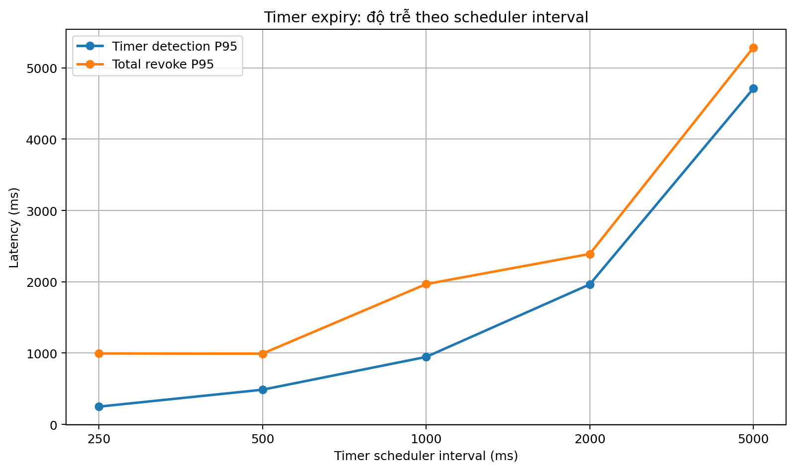

P95 total revoke:

- scheduler 250 ms: **994.4 ms**
- scheduler 500 ms: **992.0 ms**
- scheduler 1000 ms: **1967.2 ms**
- scheduler 2000 ms: **2390.3 ms**
- scheduler 5000 ms: **5286.7 ms**

Timer-based vẫn chịu hai lớp chờ:

```text
dependency_due_at
→ timer scheduler tạo TIMER_DUE
→ trigger-event poller lấy event
→ re-evaluate, revoke, postUpdate
→ event processed
```

## 7.3. Phase alignment vẫn tồn tại

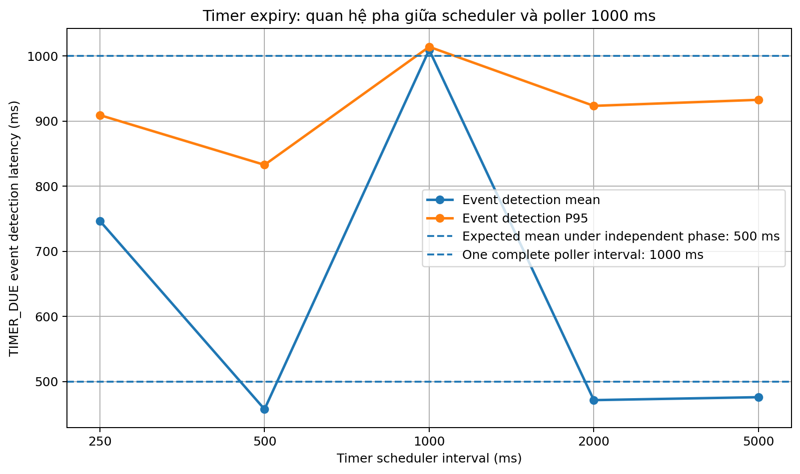

Với poller interval cố định 1000 ms:

- Scheduler 1000 ms có event detection:
  - min **1000.597 ms**
  - mean **1009.373 ms**
  - P95 **1014.051 ms**
- Hầu như mỗi TIMER_DUE event phải chờ trọn một chu kỳ poller.

Phase alignment không phải do `postUpdate`; nó xuất hiện ở phần chờ trước khi event được picked. Vì vậy kết quả không đơn điệu giữa scheduler 250, 500, 1000 và 2000 ms vẫn cần được giải thích bằng quan hệ pha giữa hai tác vụ định kỳ.

---

# 8. Sai lệch giữa total revoke và tổng các thành phần

Đặt:

```text
D = dependency_due_at
O = event_occurred_at
R = session_revoked_at
F = event_processed_at
```

Theo metric:

```text
timer_detection_latency_ms = O - D
timer_event_end_to_end_latency_ms = F - O
timer_total_revoke_latency_ms = R - D
```

Do đó:

```text
timer_detection_latency_ms
+ timer_event_end_to_end_latency_ms
- timer_total_revoke_latency_ms

= F - R
= event_processed_at - session_revoked_at
```

Sau khi bật `postUpdate`, khoảng chênh lệch là:

- Mean: **8.586 ms**
- Median: **8.558 ms**
- P95: **10.245 ms**
- Min: **4.533 ms**
- Max: **18.360 ms**

Trước khi bật `postUpdate`, mean chỉ khoảng **2.711 ms**.

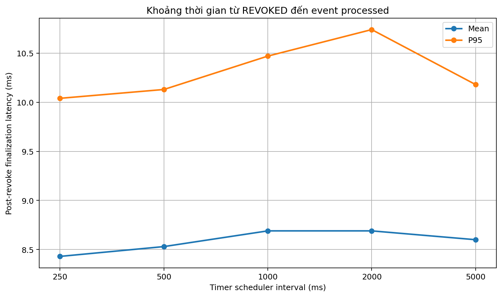

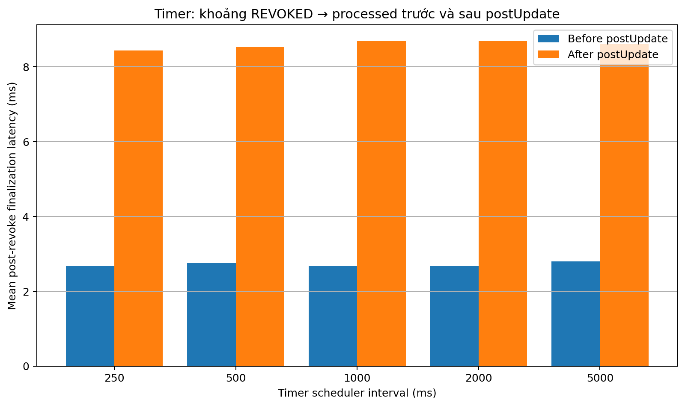

Khoảng `REVOKED → processed` đã tăng từ khoảng 2.7 ms lên 8.6 ms. Điều này phù hợp với việc:

1. session được ghi mốc `revoked_at`;
2. hệ thống tiếp tục chạy `postUpdate` và các thao tác cuối;
3. sau đó event mới được đánh dấu `processed_at`.

Tuy nhiên, khoảng này không phải thuần túy thời gian `postUpdate`; nó còn có thể gồm logging, cập nhật event, transaction và các chi phí hoàn tất khác.

## Hệ quả khi diễn giải metric

- `revoke_latency_ms` đo thời gian đến khi session được ghi nhận `REVOKED`.
- `event_end_to_end_latency_ms` đo thời gian đến khi toàn bộ event workflow hoàn tất.
- Nếu cần đo riêng hiệu năng `postUpdate`, nên bổ sung:
  - `post_update_started_at`
  - `post_update_completed_at`
  - hoặc `post_update_duration_ms`

---

# 9. Outlier và điểm bất thường

| Scenario/configuration | Observed value | Interpretation |
| --- | --- | --- |
| Baseline, poller 500 ms | processing max 23.879 ms; re-evaluation max 11.844 ms | Rare spike; P95 processing remains 20.529 ms. |
| Baseline, poller 250 ms | post-revoke finalization max 14.549 ms | Largest baseline finalization gap; P95 is only 9.573 ms. |
| Multi-session, 100 sessions | processing max 1010.252 ms; revoke spread max 506.333 ms | One run exceeded the 1000 ms poller interval; possible delayed next poll/backlog under sustained load. |
| Multi-session, 100 sessions | per-session re-evaluation max 24.116 ms | Per-session outlier; aggregate P95 remains 323.430 ms. |
| Timer, scheduler 5000 ms | processing max 28.941 ms; finalization max 18.360 ms | Rare processing/finalization spike; P95 processing remains 20.827 ms. |
| Timer, scheduler 1000 ms | event detection min 1000.597 ms, mean 1009.373 ms | Persistent scheduler–poller phase alignment, not a random outlier. |

Nhìn chung:

- Baseline ổn định, không có cold-start spike lớn như một số lần đo cũ.
- Hai batch của multi-session có processing mean chênh dưới khoảng 4%, cho thấy khả năng lặp lại tốt.
- Timer processing giữa hai batch chênh dưới khoảng 7%.
- Các outlier đơn lẻ không làm P95 biến động tương ứng, ngoại trừ trường hợp 100 session cần được lưu ý về giới hạn tải.

Không nên loại outlier nếu không có bằng chứng lỗi thí nghiệm.

---

# 10. Đánh giá tổng hợp sau khi bật postUpdate

## 10.1. Các kết luận không thay đổi

- Poller interval ngắn giúp phát hiện và revoke nhanh hơn.
- Poller interval ngắn làm tăng empty polling.
- Poller interval đại diện cho kịch bản 2 và 3 vẫn là **1000 ms**.
- DB-event processing và multi-session scaling vẫn gần tuyến tính.
- Timer phase alignment vẫn tồn tại và độc lập với `postUpdate`.

## 10.2. Các thay đổi đáng kể

- Baseline event processing tăng khoảng 5–6 ms/event.
- Timer event processing tăng khoảng 5–6 ms/event.
- Multi-session processing tăng khoảng 40–59%, và mức tăng tích lũy theo số session.
- Khoảng `revoked_at → processed_at` tăng từ khoảng 2.7 lên 8.6 ms.
- Ở 100 session, processing P95 đạt khoảng 834 ms và đã có một lượt vượt 1000 ms.

## 10.3. Đánh giá kiến trúc

Việc chạy `postUpdate` trong đường revoke làm workflow đầy đủ hơn về mặt UCON mutability, nhưng tạo thêm chi phí tuần tự trên mỗi session. Với quy mô 1–50 session, kết quả vẫn tương đối an toàn so với poller interval 1000 ms. Ở 100 session, hệ thống đã tiến gần giới hạn một chu kỳ poller và nên được xem là điểm cần tối ưu nếu muốn mở rộng.

Các hướng cải thiện:

- batch hoặc gom các `postUpdate` có thể thực hiện chung;
- tách update không bắt buộc khỏi critical revoke path;
- thực thi song song có kiểm soát nếu bảo đảm transaction và tính nhất quán;
- thêm metric riêng cho postUpdate;
- đo thêm nhiều event đồng thời và backlog;
- tạo kịch bản riêng cho user end session.

---

# 11. Giới hạn của phép đo

1. Không đo riêng user-end path dù code đã bật `postUpdate` ở đó.
2. Không có CPU, memory, DB I/O, query duration hoặc GC metric.
3. Idle polling chỉ có một cửa sổ 5 phút cho mỗi interval.
4. Timer chỉ dùng poller 1000 ms.
5. Scheduler–poller phase alignment chưa được chủ động ngẫu nhiên hóa.
6. Multi-session chỉ đo một event ảnh hưởng nhiều session, chưa đo nhiều event đồng thời.
7. So sánh trước–sau được thực hiện ở hai thời điểm chạy khác nhau, nên ngoài code còn có thể chịu nhiễu từ môi trường.
8. Biểu đồ điểm giao dùng chuẩn hóa và trọng số bằng nhau.

---

# 12. Danh sách biểu đồ

| File | Nội dung |
|---|---|
| `charts/01_db_event_detection_latency.png` | Interval → detection mean/P95 |
| `charts/02_db_event_end_to_end_latency.png` | Interval → end-to-end và revoke P95 |
| `charts/03_idle_polling_overhead.png` | Interval → poll runs/min |
| `charts/04_representative_interval_tradeoff.png` | Điểm cân bằng latency–polling |
| `charts/05_multi_session_scaling.png` | Session count → processing/re-evaluation/overhead |
| `charts/06_multi_session_revoke_spread.png` | Session count → độ trễ tích lũy |
| `charts/07_timer_latency_by_scheduler.png` | Scheduler interval → timer detection/total revoke |
| `charts/08_timer_phase_alignment.png` | Scheduler interval → TIMER_DUE event detection |
| `charts/09_post_revoke_finalization.png` | REVOKED → processed mean/P95 |
| `charts/10_before_after_baseline_processing.png` | Baseline trước–sau postUpdate |
| `charts/11_before_after_multi_processing.png` | Multi-session trước–sau postUpdate |
| `charts/12_before_after_finalization.png` | Finalization gap trước–sau postUpdate |
